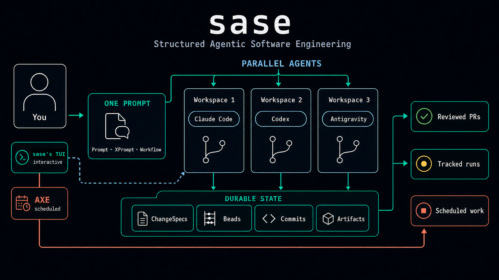
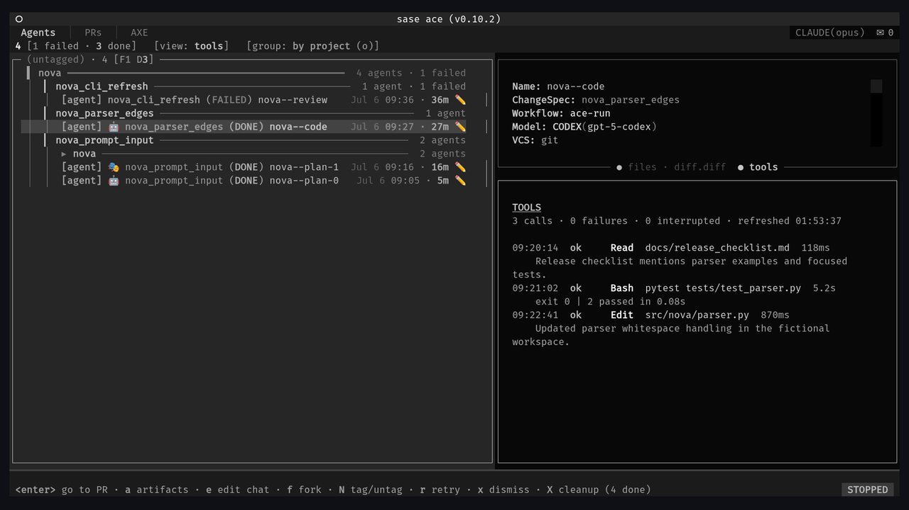
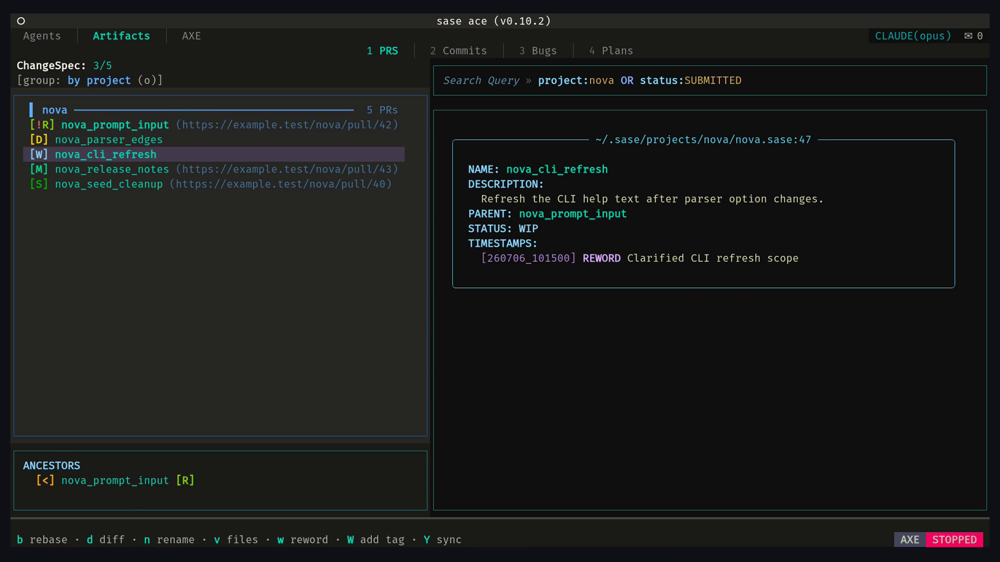

<div align="center">

# sase

**One developer. A team of coding agents. Tracked, reviewable, repeatable work.**

[](https://sase.sh/)
[](https://github.com/sase-org/sase/actions/workflows/ci.yml)
[](https://pypi.org/project/sase/)
[](https://pypi.org/project/sase/)
[](LICENSE)



<p><em>One prompt fans out to parallel agents in isolated workspaces; ACE supervises, AXE schedules, durable state tracks ChangeSpecs, beads, and artifacts, and reviewed PRs are the output.</em></p>

</div>

**sase** (Structured Agentic Software Engineering, pronounced "sassy") turns Claude Code, Codex, Antigravity, Qwen Code,
and OpenCode into a coordinated engineering team. One developer supervises parallel agents in isolated workspaces, with
every run tracked, reviewable, and repeatable.

**Status:** sase is alpha software, and its interfaces and workflows are still evolving. It supports POSIX systems
(Linux and macOS) only; Windows is not supported. sase assumes you already use and pay for at least one agent CLI and
prefer opinionated git-based, workspace-per-agent workflows; if you want a standalone agent instead of a coordination
layer, use those CLIs directly.

## Why sase

- Launch, monitor, resume, and archive agent runs from one keyboard-driven TUI (**ACE**).
- Run agents in parallel, each in an isolated numbered workspace clone.
- Keep prompts and multi-step workflows reusable (**XPrompts**) instead of trapped in shell history.
- Track every PR-sized unit of work with status, commits, comments, and review state (**ChangeSpecs**).
- Schedule background and recurring agent work with the **AXE** daemon.

sase does not replace coding agents; it makes agent-driven engineering dependable.

## See it in action

**One prompt, three live agents, three models.** A single GitHub prompt fans out to Claude, Codex, and Antigravity, runs
all three agents in isolated workspaces, and keeps kill controls close at hand.


**Supervise every run.** The Agents tab shows live status, retry chains, per-agent diffs, chats, and artifact files from
one control surface.

<a href="demos/out/sase_ace_agents_observability.mp4"></a>

<em>Select the still to watch the 29-second demo.</em>

**Land tracked changes.** The PRs tab follows the ChangeSpec lifecycle from WIP to Submitted, with grouping, search,
commits, and diffs.

<a href="demos/out/sase_ace_prs_pipeline.mp4"></a>

<em>Select the still to watch the 26-second demo.</em>

## Quick start

Prerequisites: Linux or macOS (POSIX; Windows is not supported), Python 3.12+, [uv](https://docs.astral.sh/uv/), `git`,
a text editor (`$EDITOR`, falling back to `nvim` then `vim`), and one authenticated agent CLI: Claude Code, Codex,
Antigravity CLI (`agy`), Qwen Code, or OpenCode.

```bash
uv tool install sase   # add a plugin too: uv tool install sase --with sase-github
sase doctor            # check install, config, and provider authentication
sase run "#git:home summarize what this repository does; do not change files"
sase ace               # open the interactive control surface
```

The `#git:home` workspace reference targets the built-in `home` project, which is bootstrapped automatically, so the
first run needs no project setup. After these commands, `sase ace` opens the TUI with the completed run visible on the
Agents tab.

If `sase doctor` reports a missing provider, install and authenticate it, then run the check again; see
[Agent Providers](https://sase.sh/agent_providers/). For full installation details use [INSTALL.md](INSTALL.md), or
follow [Getting Started](https://sase.sh/getting_started/) for the guided path.

## Works with your agents

| Agent                                                         | Status        |
| ------------------------------------------------------------- | ------------- |
| [Claude Code](https://docs.anthropic.com/en/docs/claude-code) | **Supported** |
| [Antigravity CLI (`agy`)](https://antigravity.google/)        | **Supported** |
| [Codex](https://github.com/openai/codex)                      | **Supported** |
| [Qwen Code](https://github.com/QwenLM/qwen-code)              | **Supported** |
| [OpenCode](https://opencode.ai/)                              | **Supported** |

## Learn more

**The complete documentation lives at [sase.sh](https://sase.sh/).**

- [Getting Started](https://sase.sh/getting_started/) — the guided beginner path
- [ACE TUI](https://sase.sh/ace/) — the interactive control surface
- [XPrompts](https://sase.sh/xprompt/) — reusable prompts and multi-step workflows
- [ChangeSpecs](https://sase.sh/change_spec/) — tracked PR-sized units of work
- [AXE Automation](https://sase.sh/axe/) — scheduled and background agent work
- [Spec-Driven Development](https://sase.sh/sdd/) — plans, epics, and beads
- [Plugins](https://sase.sh/plugins/) — GitHub, Telegram, editor, and provider integrations
- [CLI Reference](https://sase.sh/cli/) — every command
- [Blog](https://sase.sh/blog/) — announcements and deep dives
- [The SASE Handbook (PDF)](https://sase.sh/downloads/sase-handbook.pdf) — the full documentation as a single document
- [Support](https://github.com/sase-org/sase/issues) — report bugs and ask questions in GitHub Issues

## Development

Development requires [`just`](https://github.com/casey/just). Start with [CONTRIBUTING.md](CONTRIBUTING.md), then see
[Development](https://sase.sh/development/) for the full contributor guide.

```bash
git clone https://github.com/sase-org/sase
cd sase
uv venv .venv
source .venv/bin/activate
just install
sase core health
```

Run `just check-full` before submitting changes.

## Acknowledgements

sase builds on [Boris Cherny's parallel-agents demonstration](https://x.com/bcherny/status/2007179832300581177),
[Steve Yegge's beads](https://github.com/steveyegge/beads),
[Agentic Software Engineering](https://arxiv.org/abs/2509.06216), and [PDL](https://arxiv.org/abs/2410.19135). See the
[full acknowledgements](docs/acknowledgements.md).

## License

sase is licensed under the MIT License. See [LICENSE](LICENSE).
