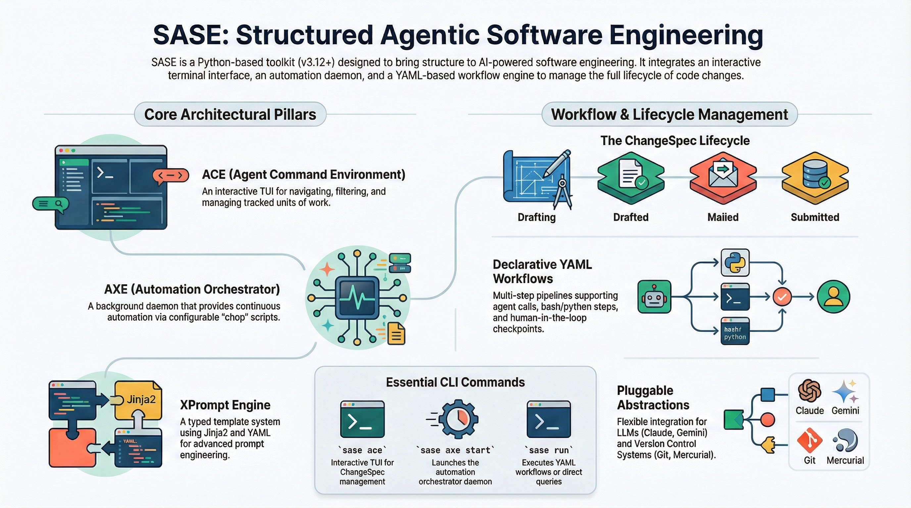
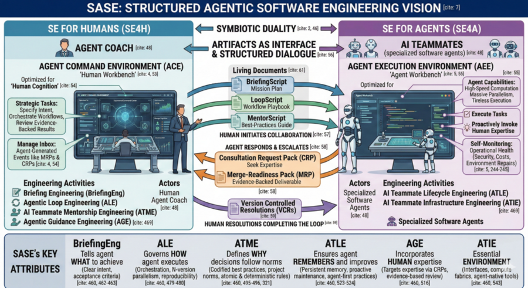
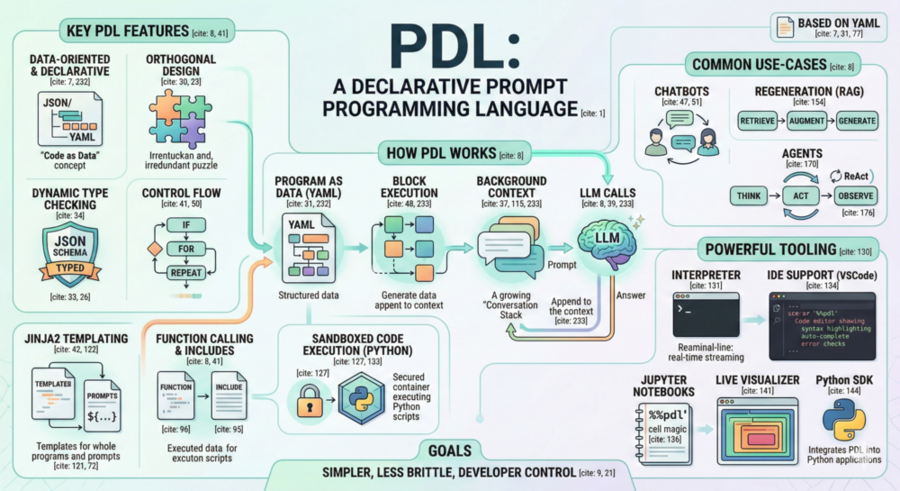

# sase — Structured Agentic Software Engineering

[](https://github.com/astral-sh/ruff)
[](https://mypy-lang.org/)
[](https://docs.pytest.org/)
[](https://tox.wiki/)

## Overview

**sase** (pronounced "sassy") is a Python toolkit for AI-powered software engineering workflows. It combines an
interactive TUI, a scheduling daemon, a YAML workflow engine, and pluggable LLM/VCS abstractions into a cohesive system
for managing code changes at scale.



## Supported Coding Agents

sase is designed to work with the coding agents you already use:

| Agent                                                         | Status        |
| ------------------------------------------------------------- | ------------- |
| [Claude Code](https://docs.anthropic.com/en/docs/claude-code) | **Supported** |
| [Gemini CLI](https://github.com/google-gemini/gemini-cli)     | **Supported** |
| [Codex](https://github.com/openai/codex)                      | **Supported** |

sase doesn't replace these agents — it **orchestrates** them. It provides the scheduling, tracking, and workflow
infrastructure that turns individual agent runs into a managed software engineering pipeline.

## Vision

Coding agents are powerful — but **using them in a real engineering workflow is still painful.**

Running a single agent on a single task works fine. The problems start when you try to do it repeatedly, across multiple
changes, with any kind of structure. sase exists to solve the coordination problems that show up at that point:

> **Scheduling** — Agent runs are hard to schedule, monitor, and resume reliably.
>
> **Prompt Logic** — Multi-step prompt pipelines get fragile fast when they're scattered across shell scripts and
> scratch files.
>
> **Tracking** — Work gets lost without a first-class unit for status, ownership, metadata, and review state.
>
> **Portability** — Teams need one system above the agent layer, not a separate workflow for every provider.
>
> **Supervision** — Automation still needs human checkpoints, VCS integration, and reproducible execution.

---

<table>
<tr><th>Before sase</th><th>After sase</th></tr>
<tr>
<td>

Prompts live in shell history and scratch files. Each agent run is a one-off terminal session. Status is tracked in your
head (or not at all). Switching agents means rewriting your wrapper scripts. There's no audit trail and no way to hand
work off to a teammate.

</td>
<td>

**ChangeSpecs** give each unit of work a tracked lifecycle. **Workflows** define reproducible multi-step pipelines.
**ACE** provides the operational layer for navigating and supervising changes. **AXE** handles background scheduling.
The whole system is agent-agnostic — swap providers without rewriting your workflow definitions.

</td>
</tr>
</table>

The goal isn't to make agents smarter. It's to make **agent-driven software engineering dependable.**

## Key Features

- **ACE** — Interactive TUI for navigating, filtering, and managing ChangeSpecs
- **AXE** — Lumberjack-based daemon for continuous automation via configurable chop scripts
- **XPrompt** — Typed prompt templates with reference expansion, YAML front matter, semantic tags, and CLI tools for
  expansion, listing, workflow visualization, and DAG graphing
- **Workflows** — YAML-defined multi-step pipelines with agent, bash, and python steps, control flow, parallel
  execution, and human-in-the-loop support
- **ChangeSpec** — Tracked unit of work with a full status lifecycle
- **Mentors** — Automated AI code review agents with configurable profiles, structured JSON output, and TUI-based review
  and apply workflow
- **LLM Providers** — Pluggable AI abstraction (Claude, Codex, Gemini) with pre/post-processing
- **VCS Providers** — Pluggy-based version control abstraction (git bundled; GitHub and Mercurial via plugin packages)
- **Query Language** — Boolean expression language for filtering and searching ChangeSpecs

## Architecture

```
┌────────────────────────────────────────────────────────┐
│                        sase CLI                        │
├─────────────┬────────────┬────────────┬────────────────┤
│  ace        │  axe       │  run       │    commit      │
│  (TUI)      │  (daemon)  │ (workflows)│  (VCS ops)     │
├─────────────┴────────────┴────────────┴────────────────┤
│                      Core Engine                       │
│    ┌────────────┐  ┌────────────┐  ┌────────────┐      │
│    │ ChangeSpec │  │  XPrompt   │  │  Workflows │      │
│    │  Tracking  │  │  Templates │  │   (YAML)   │      │
│    └────────────┘  └────────────┘  └────────────┘      │
├───────────────────┬─────────────────┬──────────────────┤
│   LLM Provider    │  VCS Provider   │ Workspace Prov.  │
│(Claude,Codex,Gem) │ (pluggy plugins)│ (pluggy plugins) │
├───────────────────┴─────────────────┴──────────────────┤
│                    Plugin Packages                     │
│  sase-github · sase-google · sase-telegram · sase-nvim │
└────────────────────────────────────────────────────────┘
```

## Requirements

- Python 3.12+
- [uv](https://docs.astral.sh/uv/) (recommended for dependency management)
- [just](https://github.com/casey/just) (task runner)

## Quick Start

```bash
# Create and activate a virtual environment
uv venv .venv
source .venv/bin/activate

# Install in editable mode with dev dependencies
just install

# Run the CLI
sase
```

## CLI Commands

| Command                    | Description                                                                      |
| -------------------------- | -------------------------------------------------------------------------------- |
| `sase ace`                 | Interactive TUI for navigating and managing ChangeSpecs                          |
| `sase axe chop`            | List or run individual chop scripts                                              |
| `sase axe lumberjack`      | List, run, or check status of lumberjacks                                        |
| `sase axe start`           | Start the lumberjack-based daemon (orchestrator mode)                            |
| `sase axe stop`            | Stop the running axe orchestrator                                                |
| `sase bead`                | Lightweight git-native issue tracking (plans, phases, dependencies)              |
| `sase comments`            | Preview mentor comments from JSON with syntax-highlighted code context           |
| `sase commit`              | Create a commit with formatted CL description and metadata                       |
| `sase config layers`       | Show per-layer breakdown of the configuration merge chain                        |
| `sase config mentor-match` | Trace mentor profile matching for a specific ChangeSpec                          |
| `sase config show`         | Dump the final merged configuration as YAML (supports `--key` filtering)         |
| `sase init-git`            | Initialize a new bare-repo-backed git project                                    |
| `sase logs`                | Collect and package agent run logs for a date range                              |
| `sase notify`              | Create a notification (reads JSON from stdin or uses flags)                      |
| `sase path`                | Print well-known sase paths (`xprompts-dir`, `xprompts-schema`, `config-schema`) |
| `sase plan`                | Submit a plan for approval (used by `/sase_plan` skill)                          |
| `sase questions`           | Ask the user questions (used by `/sase_questions` skill)                         |
| `sase restore`             | Restore a reverted ChangeSpec by re-applying its diff                            |
| `sase revert`              | Revert a ChangeSpec by pruning its CL and archiving its diff                     |
| `sase run`                 | Execute workflows, resume agents, run queries, or open editor/history picker     |
| `sase search`              | Search and filter ChangeSpecs with query expressions                             |
| `sase xprompt expand`      | Expand prompt templates with sase references (supports `--trace`)                |
| `sase xprompt explain`     | Dry-run visualization of a workflow's execution plan                             |
| `sase xprompt graph`       | Generate a DAG visualization of a workflow (Mermaid or text)                     |
| `sase xprompt list`        | List all available xprompts with metadata, inputs, tags, and preview (JSON)      |

## Core Concepts

### ChangeSpec

A ChangeSpec is the tracked unit of work in sase. Each ChangeSpec follows a status lifecycle (WIP → Draft → Ready →
Mailed → Submitted) and carries structured metadata such as reviewers, tags, and comments. See
[`docs/change_spec.md`](docs/change_spec.md) for the full field reference.

### Workflows

Workflows are YAML-defined multi-step pipelines that can include agent steps (LLM calls), bash steps, and python steps.
They support control flow (conditionals, loops), parallel execution, and human-in-the-loop checkpoints. See
[`docs/workflow_spec.md`](docs/workflow_spec.md) for the format specification.

### XPrompt

XPrompt is the prompt template system. Templates use YAML front matter for metadata and Jinja2 for rendering. References
like `#name(args)` are expanded from multiple discovery locations (project, user, built-in). XPrompts can be annotated
with semantic role tags (`vcs`, `crs`, `fix_hook`, `rollover`) for lookup-by-role. XPrompt powers both standalone prompt
expansion and the prompt steps within workflows. The `sase xprompt` CLI provides subcommands for expanding prompts
(`expand --trace`), listing all available xprompts (`list`), visualizing workflow execution plans (`explain`), and
generating workflow DAGs (`graph`).

## Project Structure

```
src/sase/
├── main/                  # CLI entry point and argument parsing
│   ├── plugin_discovery.py # Entry-point-based plugin discovery
│   └── query_handler/     # Query execution handler
├── ace/                   # Interactive TUI and ChangeSpec engine
│   ├── changespec/        # ChangeSpec data model and parsing
│   ├── query/             # Query language (boolean expressions, filters)
│   ├── tui/               # Textual-based TUI interface
│   │   ├── thinking/      # Claude thinking block parser and display
│   │   ├── keymaps/       # Keymap registry, loader, and types
│   │   ├── actions/       # Keybinding action handlers
│   │   ├── models/        # Agent, workflow, and fold-state data models
│   │   ├── modals/        # Modal dialogs (query, status, hook history, etc.)
│   │   └── widgets/       # TUI widget components
│   │       ├── file_panel/   # Agent file viewer (diff, display, trimming)
│   │       ├── prompt_panel/ # Agent prompt viewer
│   │       └── prompt_text_area.py # Multiline prompt input (vim NORMAL/INSERT modes)
│   ├── handlers/          # Event and action handlers
│   ├── hooks/             # Lifecycle hooks (execution, formatting, persistence)
│   ├── comments/          # Comment management
│   ├── scheduler/         # Task scheduling within ACE
│   └── workflows/         # ACE-specific workflow integrations
├── agent/                 # Agent subprocess management
│   ├── launcher.py        # Agent subprocess launcher
│   ├── multi_prompt.py    # Multi-prompt parsing (frontmatter + segment splitting)
│   ├── multi_prompt_launcher.py # Sequential multi-agent launch orchestration
│   └── names.py           # Agent auto-naming utilities
├── axe/                   # Lumberjack-based daemon and agent runners
│   ├── orchestrator.py    # Multi-lumberjack supervisor
│   ├── lumberjack.py      # Single-lumberjack scheduler loop
│   ├── chop_script_runner.py # External chop script discovery and execution
│   ├── config.py          # Lumberjack and chop configuration
│   ├── runner_pool.py     # Shared concurrent runner pool
│   ├── hook_jobs.py       # 1-second interval hook/mentor/workflow jobs
│   ├── run_agent_runner.py # Agent run orchestration
│   ├── run_workflow_runner.py # Workflow run orchestration
│   ├── state.py           # Lumberjack state persistence
│   ├── process.py         # Process management utilities
│   └── cli.py             # Axe CLI argument parsing
├── config/                # Configuration loading and management
│   ├── core.py            # Config file discovery, deep-merge, and loading
│   ├── mentor.py          # Mentor profile configuration
│   └── metahook.py        # Metahook configuration
├── core/                  # Shared core utilities
│   ├── time.py            # Time formatting and parsing
│   ├── paths.py           # Path resolution helpers
│   ├── shell.py           # Shell command utilities
│   └── changespec.py      # ChangeSpec utility functions
├── history/               # History persistence
│   ├── chat.py            # Chat history persistence
│   ├── command.py         # Command history persistence
│   ├── hook.py            # Hook history persistence
│   └── prompt.py          # Prompt history persistence and querying
├── sdd/                   # Spec-driven development utilities
│   ├── files.py           # SDD file management (specs, plans)
│   └── beads.py           # SDD bead integration
├── workflows/             # All change-lifecycle workflows
│   ├── accept/            # Change acceptance workflows
│   ├── commit/            # Commit creation workflows
│   ├── commit_utils/      # COMMITS entry management
│   └── rewind/            # Revert and restore operations
├── xprompts/              # Built-in xprompt workflows and schema
├── xprompt/               # Prompt templates and workflow execution
│   ├── processor.py       # XPrompt expansion engine
│   ├── directives.py      # %name directive parsing (%model, %name, %wait)
│   ├── loader.py          # XPrompt discovery and loading
│   ├── explain.py         # Dry-run workflow visualization (xprompt explain)
│   ├── graph.py           # DAG visualization (xprompt graph)
│   ├── _trace.py          # Expansion trace for --trace flag
│   ├── workflow_executor*.py # Workflow execution (steps, loops, parallel)
│   ├── workflow_loader*.py   # Workflow YAML parsing and validation
│   └── workflow_validator.py # Cross-step validation (field refs, finally, artifacts)
├── llm_provider/          # Pluggable LLM abstraction (Claude, Codex, Gemini)
├── vcs_provider/          # VCS abstraction (pluggy-based plugin system)
│   ├── _hookspec.py       # Pluggy hook specifications (VCSHookSpec)
│   ├── _plugin_manager.py # Plugin manager wrapping pluggy
│   ├── _registry.py       # VCS detection and provider registry
│   ├── _base.py           # Base VCS provider class
│   ├── _command_runner.py # Shared CommandRunner mixin
│   └── plugins/           # Built-in VCS plugins
│       ├── _git_common.py # Shared git operations (GitCommon base class)
│       └── bare_git.py    # BareGitPlugin (local bare-remote git repos)
├── workspace_provider/    # Workspace abstraction (pluggy-based plugin system)
│   ├── _hookspec.py       # Pluggy hook specifications (WorkspaceHookSpec)
│   ├── _plugin_manager.py # Plugin manager wrapping pluggy
│   ├── _registry.py       # Workspace detection and metadata registry
│   └── plugins/           # Built-in workspace plugins
│       └── bare_git_*.py  # BareGitWorkspacePlugin (ref resolution, submit, mail)
├── running_field/         # Workspace claim and slot management
├── bead/                  # Git-native issue tracking (plans, phases, dependencies)
├── logs/                  # Agent run log collection and packaging
├── gemini_wrapper/        # Gemini-specific integration
├── notifications/         # Notification system and delivery
├── status_state_machine/  # ChangeSpec status transitions
├── artifacts.py           # Artifact path resolution and management
├── content.py             # Content extraction and text utilities
├── output.py              # Rich console output helpers
├── scripts/               # Extracted Python utility scripts
tests/                     # Test suite (mirrors src/sase/ structure)
docs/                      # Detailed documentation
```

## Configuration

All tool configuration lives in `pyproject.toml`:

- **Build**: hatchling
- **Linting**: ruff (replaces black, isort, flake8, pylint)
- **Type checking**: mypy (strict mode)
- **Testing**: pytest + coverage
- **Multi-version testing**: tox (see `tox.ini`)

User configuration is loaded from `~/.config/sase/sase.yml` as the base, with optional `sase_*.yml` overlay files that
are deep-merged on top. A project-local `./sase.yml` in the current working directory takes highest priority. See
[`docs/configuration.md`](docs/configuration.md) for the full reference.

## Development

```bash
just install       # Install with dev deps
just fmt           # Auto-format code
just lint          # Run ruff + mypy
just test          # Run tests with coverage
just check         # All checks (fmt-check + lint + test)
just test-tox      # Test across Python 3.12, 3.13, 3.14
just clean         # Remove build artifacts
just build         # Build wheel + sdist
```

## Documentation

- [`docs/ace.md`](docs/ace.md) — ACE TUI user guide
- [`docs/beads.md`](docs/beads.md) — Bead issue tracking system
- [`docs/axe.md`](docs/axe.md) — Axe background automation daemon
- [`docs/change_spec.md`](docs/change_spec.md) — ChangeSpec field reference
- [`docs/configuration.md`](docs/configuration.md) — Configuration reference
- [`docs/llms.md`](docs/llms.md) — LLM provider documentation
- [`docs/logs.md`](docs/logs.md) — Log pack collection system
- [`docs/mentors.md`](docs/mentors.md) — Automated code review mentor system
- [`docs/notifications.md`](docs/notifications.md) — Notification system
- [`docs/plugins.md`](docs/plugins.md) — Plugin system and extension guide
- [`docs/project_spec.md`](docs/project_spec.md) — ProjectSpec format
- [`docs/query_language.md`](docs/query_language.md) — Query language reference
- [`docs/sdd.md`](docs/sdd.md) — Spec-Driven Development (SDD)
- [`docs/vcs.md`](docs/vcs.md) — VCS provider documentation
- [`docs/workspace.md`](docs/workspace.md) — Workspace provider documentation
- [`docs/workflow_spec.md`](docs/workflow_spec.md) — YAML workflow format
- [`docs/xprompt.md`](docs/xprompt.md) — XPrompt template reference

## Acknowledgements

### Boris' Method

Before sase existed, [Boris Cherny](https://borischerny.com/) — the inventor of
[Claude Code](https://docs.anthropic.com/en/docs/claude-code) — pioneered a practical workflow for parallel agentic
development: five git checkouts, each in its own tmux tab, each running Claude Code in plan mode. This was one of the
first demonstrations that a single developer could effectively supervise multiple agents working on different tasks
simultaneously, and it proved that the bottleneck in agentic software engineering isn't the agent — it's the
coordination layer around it.

sase builds directly on this insight. Where Boris' method relies on the developer to manually manage the parallelism —
switching between tmux tabs, keeping track of which checkout is doing what, copy-pasting prompts, and mentally tracking
the state of five concurrent workstreams — sase replaces that manual overhead with structured infrastructure:

- **Workspaces instead of manual checkouts** — sase's workspace provider system creates and manages isolated working
  copies programmatically, eliminating the need to manually set up and maintain parallel git checkouts.
- **ChangeSpecs instead of mental bookkeeping** — Each unit of work gets a tracked lifecycle with status, metadata, and
  history, replacing the cognitive load of remembering what's happening in each tmux tab.
- **XPrompts instead of ad-hoc prompts** — Reusable, composable prompt templates with YAML front matter replace the
  prompt fragments scattered across shell history and scratch files.
- **True SDD instead of plan mode** — Plan mode produces ephemeral plans that vanish when the session ends. sase
  persists plans and specs to disk as first-class artifacts. For larger efforts, plan files carry a bead ID in their
  frontmatter that links them to an epic in the bead tracker, and each phase of the epic gets its own bead whose ID
  appears in the corresponding commit messages — creating a traceable chain from epic to phase to commit. For smaller
  plans, commit messages include a `PLAN=<path>` tag pointing back to the plan file. The result is spec-driven
  development where the full history of intent, decomposition, and execution is preserved and queryable, not trapped in
  a single agent session's context window.
- **ACE instead of tmux** — A single TUI provides unified navigation, filtering, and management across all active
  workstreams, replacing the manual tab-switching workflow.
- **AXE instead of manual supervision** — A background daemon handles scheduling, monitoring, and lifecycle management
  of agent runs, so the developer doesn't need to babysit each session.

The core idea — that one developer can multiply their output by running several agents in parallel — was right. sase
just replaces the duct tape with a proper framework.

### Beads

[Steve Yegge's](https://steve-yegge.medium.com/) [beads](https://github.com/steveyegge/beads) (`bd`) introduced a
critical insight: AI coding agents suffer from a "50 First Dates" problem — every new session starts from scratch with
no memory of prior work. His solution was a dependency-aware graph issue tracker designed specifically for agents,
backed by [Dolt](https://github.com/dolthub/dolt) (a version-controlled SQL database), with hash-based IDs for
collision-free multi-agent writes, hierarchical epics-to-subtasks via dotted IDs, atomic `--claim` operations for agent
coordination, and semantic memory compaction to keep the working set small. The key idea was that agents don't need TODO
files or markdown plans — they need a structured, persistent memory layer they can query and update across sessions, so
that multi-session and multi-agent workflows stay coherent.

The `sase bead` command is a from-scratch reimplementation that carries this idea into sase's architecture while
drastically simplifying the surface area:

- **SQLite + JSONL instead of Dolt** — sase stores issues in SQLite for fast local queries and exports to a sorted JSONL
  file for git portability. Fresh clones rebuild the database automatically from JSONL, giving version-controlled
  persistence without an external database engine.
- **Two-tier hierarchy instead of arbitrary nesting** — sase uses a flat plans-and-phases model (plans are epics, phases
  are their children) rather than deeply nested dotted-ID trees. This maps cleanly to how agents actually break down
  work: a plan file with numbered phases.
- **Multi-workspace aggregation** — Because sase already manages multiple parallel workspaces, `sase bead` can read
  issues across all workspace clones through a merged in-memory view, giving every agent visibility into the full
  project state without Dolt's sync machinery.
- **No external binary** — beads ships as a ~37MB Go binary with its own daemon process; `sase bead` is pure Python,
  installed as part of sase, with zero additional dependencies.

The philosophical debt is real: beads proved that giving agents structured issue tracking — not just chat history —
fundamentally changes what's possible in multi-session agentic workflows. `sase bead` takes the ~5% of that system that
matters for sase's orchestration model and integrates it natively.

### Research Papers

This project was heavily influenced by two research papers:

- **[Agentic Software Engineering: Foundational Pillars and a Research Roadmap](https://arxiv.org/abs/2509.06216)**
  (Hassan et al., 2025) — This paper's vision of Structured Agentic Software Engineering (SASE) inspired the project's
  name and overall direction. Its concepts of the Agent Command Environment (ACE) and Agent Execution Environment (AEE)
  directly informed the naming and design of the `ace` TUI and `axe` daemon, respectively.

  

- **[PDL: A Declarative Prompt Programming Language](https://arxiv.org/abs/2410.19135)** (Vaziri et al., 2024) — PDL's
  approach to declarative, YAML-based prompt programming influenced the design of xprompt workflows, sase's YAML-defined
  multi-step pipelines for orchestrating LLM calls and tool execution.

  

<sub>Images generated with [Nano Banana](https://notebooklm.google.com/) (Google's NotebookLM) via Gemini.</sub>
