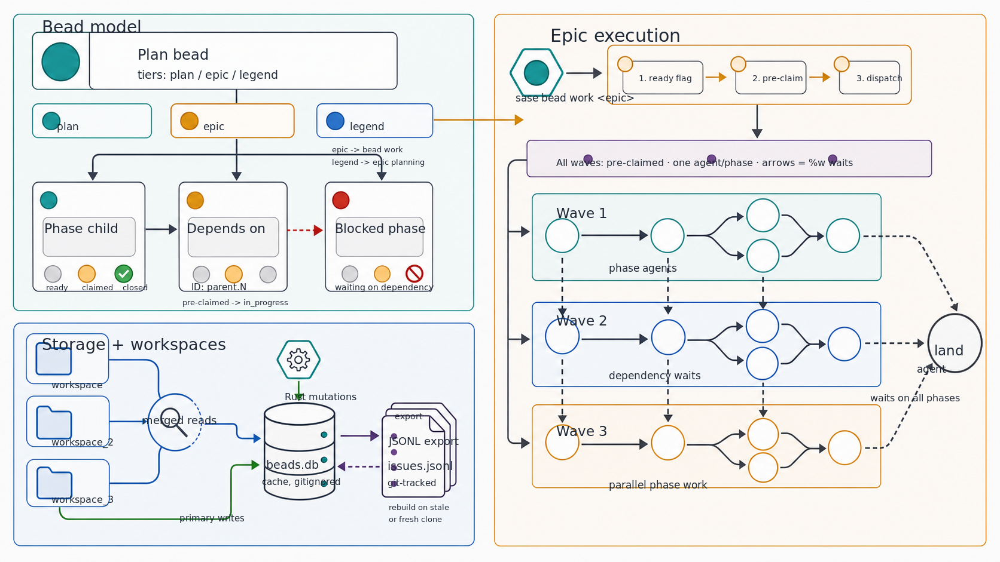

# Bead Issue Tracking

Bead is a lightweight, git-native issue tracking system built into sase. It uses Rust-backed SQLite/query/mutation logic
through the required `sase_core_rs` extension, with JSONL export for git portability (inspired by
[Fossil](https://fossil-scm.org/)). Issues are organized into plan-like containers and executable child phases. Plan
beads can represent ordinary plans, executable epics, or legend-level roadmaps through their `tier` metadata.



## Table of Contents

- [Quick Start](#quick-start)
- [Data Model](#data-model)
  - [Issue Types](#issue-types)
  - [Status Lifecycle](#status-lifecycle)
  - [Dependencies](#dependencies)
- [Storage](#storage)
  - [Directory Structure](#directory-structure)
  - [SQLite + JSONL Dual Storage](#sqlite--jsonl-dual-storage)
  - [Sync Mechanism](#sync-mechanism)
- [CLI Commands](#cli-commands)
- [Rust Backend](#rust-backend)
- [Multi-Workspace Support](#multi-workspace-support)
- [ACE TUI Integration](#ace-tui-integration)

## Quick Start

```bash
sase bead init                                          # Initialize beads in current project
sase bead create -t "New feature" --type "plan(sdd/tales/202605/feature.md)" --tier plan
sase bead create -t "Epic" --type "plan(sdd/epics/202605/epic.md)" --tier epic
sase bead create -t "Roadmap" --type "plan(sdd/legends/202605/roadmap.md)" --tier legend --epic-count 3
sase bead create -t "Linked epic" --type "plan(sdd/epics/202605/epic.md,<legend-id>)" --tier epic
sase bead create -t "Sub-task" --type "phase(beads-001)"   # Create a phase under a plan
sase bead list                                          # List all issues
sase bead list --status=open                            # List open issues
sase bead ready                                         # Show issues ready to work on
sase bead show beads-001                                # View issue details
sase bead update beads-001.1 --status=in_progress       # Claim an issue
sase bead open beads-001.1                              # Reopen an issue
sase bead close beads-001.1                             # Close an issue
sase bead dep add beads-001.2 beads-001.1               # Add dependency
sase bead blocked                                       # Show blocked issues
sase bead sync                                          # Commit JSONL to git
sase bead stats                                         # Project statistics
sase bead doctor                                        # Health check
sase bead work beads-001                                # Launch agents for an epic or legend plan bead
```

## Data Model

### Issue Types

| Type      | Description                              | ID Format            |
| --------- | ---------------------------------------- | -------------------- |
| **Plan**  | Plan-like container with a tier          | `{prefix}-{counter}` |
| **Phase** | Executable task within an epic/plan bead | `{parent_id}.{N}`    |

Plans are groupings that can optionally link to an SDD file via the `design` field. Phases always belong to a parent
plan and use hierarchical IDs (e.g., `beads-001.1`, `beads-001.2`).

Plan beads carry a tier:

| Tier     | SDD Path                    | Behavior                                                                      |
| -------- | --------------------------- | ----------------------------------------------------------------------------- |
| `plan`   | `sdd/tales/{YYYYMM}/*.md`   | Normal non-epic implementation plan                                           |
| `epic`   | `sdd/epics/{YYYYMM}/*.md`   | Executable multi-phase plan accepted by `sase bead work`                      |
| `legend` | `sdd/legends/{YYYYMM}/*.md` | Higher-level coordination plan; launches epic-planning agents by `epic_count` |

Linked epics use the existing parented plan syntax:

```bash
sase bead create --title "Epic" --type plan(sdd/epics/202605/epic.md,<legend_bead_id>) --tier epic
```

### Status Lifecycle

| Status        | Icon | Description               |
| ------------- | ---- | ------------------------- |
| `open`        | `○`  | Not started               |
| `in_progress` | `◐`  | Currently being worked on |
| `closed`      | `✓`  | Completed or abandoned    |

Status can transition freely between any values via `sase bead update --status=<status>`. `sase bead open <id>` is a
shortcut for `sase bead update <id> --status=open`.

### Dependencies

Dependencies are one-way relationships: issue A **depends on** issue B. An issue is:

- **Ready** if it is `open` and all its dependencies are `closed`.
- **Blocked** if it has at least one dependency with status `open` or `in_progress`.

## Storage

### Directory Structure

When version-controlled mode is enabled (`sdd.version_controlled` config):

```
sdd/beads/
  beads.db              # SQLite database (gitignored)
  issues.jsonl          # Git-tracked JSONL export
  config.json           # Configuration (issue prefix, counter, owner)
```

In non-version-controlled mode, the directory is `.sase/sdd/beads/` with the same structure.

Read paths also recognize the older workspace-local `.sase_beads/` directory while legacy projects are being migrated.
New bead stores should use `sdd/beads/` in version-controlled mode or `.sase/sdd/beads/` in local mode.

### SQLite + JSONL Dual Storage

Rust owns the bead storage/query/mutation path. SQLite is the local query cache and mutation target; JSONL is the
git-portable format that gets committed. The two are kept in sync:

- **Writes** run through Rust mutation transactions, update SQLite, then export the portable JSONL state.
- **Reads** run through Rust read APIs, rebuilding SQLite from JSONL first when the cache is missing or stale.
- **Fresh clones** rebuild the SQLite database automatically from `issues.jsonl` on first access.

The `.gitignore` excludes `beads.db*` files so only `issues.jsonl` and `config.json` are tracked in git.

### Sync Mechanism

`sase bead sync` exports the current SQLite state to `issues.jsonl` and commits it to git. The JSONL file contains one
JSON object per line, sorted by issue ID for clean diffs.

On project open, if the JSONL file is newer than the database (or the database is missing), the database is
automatically rebuilt from JSONL. This handles fresh clones and manual JSONL edits transparently.

## CLI Commands

### `sase bead init`

Initialize the beads directory in the current project.

### `sase bead create`

Create a new issue.

| Flag                | Required | Description                                                                 |
| ------------------- | -------- | --------------------------------------------------------------------------- |
| `-t, --title`       | yes      | Issue title                                                                 |
| `-T, --type`        | yes      | Bead type: `plan(<file>)`, `plan(<file>,<parent>)`, or `phase(<parent_id>)` |
| `-d, --description` | no       | Issue description                                                           |
| `-a, --assignee`    | no       | Assignee name                                                               |
| `--tier`            | no       | Plan-bead tier: `plan`, `epic`, or `legend`                                 |
| `-c, --changespec`  | no       | Attach a ChangeSpec name to a plan bead                                     |
| `-b, --bug-id`      | no       | Bug ID for the attached ChangeSpec; requires `--changespec`                 |
| `-E, --epic-count`  | no       | Positive number of epics proposed by a legend plan bead                     |

ChangeSpec metadata is valid only on plan beads. It is used by the epic-approval and `sase bead work` flows to keep plan
beads linked to the ChangeSpec they are intended to produce.

### `sase bead list`

List issues with optional filtering. Closed beads are excluded from the default output.

| Flag           | Values                          | Description                   |
| -------------- | ------------------------------- | ----------------------------- |
| `-s, --status` | `open`, `in_progress`, `closed` | Filter by status (repeatable) |
| `-t, --type`   | `plan`, `phase`                 | Filter by type (repeatable)   |
| `--tier`       | `plan`, `epic`, `legend`        | Filter by plan-bead tier      |

### `sase bead show <id>`

Display complete details for an issue including status, type, tier, epic count, parent/children, dependencies, blockers,
description, notes, ChangeSpec metadata, and linked plan path.

### `sase bead ready`

Show issues that are ready to work on: `open` status with all dependencies `closed`.

### `sase bead open <id>`

Reopen an issue by setting its status to `open`. This is equivalent to `sase bead update <id> --status=open`.

### `sase bead update <id>`

Update one or more fields on an issue.

| Flag                | Description              |
| ------------------- | ------------------------ |
| `-s, --status`      | Change status            |
| `-t, --title`       | Change title             |
| `-d, --description` | Change description       |
| `-n, --notes`       | Change notes             |
| `-D, --design`      | Change plan path         |
| `-a, --assignee`    | Change assignee          |
| `--tier`            | Change plan tier         |
| `-E, --epic-count`  | Change legend epic count |

### `sase bead close <id> [<id2> ...]`

Close one or more issues.

| Flag           | Description                |
| -------------- | -------------------------- |
| `-r, --reason` | Optional close reason text |

### `sase bead rm <id>`

Remove an issue and cascade-delete all its children. This is irreversible.

### `sase bead dep add <issue> <depends_on>`

Add a dependency: `<issue>` depends on `<depends_on>`. The issue becomes blocked if the dependency is not yet closed.

### `sase bead blocked`

Show all issues that have at least one active (non-closed) blocker.

### `sase bead sync`

Export the SQLite database to JSONL and commit to git.

| Flag           | Description                          |
| -------------- | ------------------------------------ |
| `-s, --status` | Check sync status without committing |

### `sase bead stats`

Show project statistics: total, open, in-progress, and closed counts, plus plan and phase counts.

### `sase bead doctor`

Run health checks on the beads database. Checks for:

- Missing `config.json`, `issues.jsonl`, or `beads.db`
- Uncommitted JSONL changes
- Orphan children (phases whose parent plan is missing)

If bead commands fail before opening a store, run `sase core health` first. It verifies that the required `sase_core_rs`
extension is importable and exposes the representative bead CLI binding used by the fast path.

### `sase bead onboard`

Display a quick-start guide with common command examples.

### `sase bead work <id>`

Run an entire epic-tier plan end-to-end by launching one agent per phase plus a final land agent, or run a legend-tier
plan by launching one epic-planning agent per stored `epic_count`.

For epic-tier plans, the command:

1. Validates that `<epic_id>` resolves to an issue of type `plan` with `tier=epic`. If the plan is already marked
   `is_ready_to_work`, the command treats the run as a retry and schedules any remaining non-closed phases.
2. Scans the live agent registry for any visible agent already named `<epic_id>.<N>` (for any open phase), `<epic_id>`
   (for the land agent), or the legacy `<epic_id>.land` land-agent name, and refuses to launch when a collision exists,
   listing the offending artifact directories so the user can revive, dismiss, or rename the orphan first. (`--dry-run`
   downgrades this to a warning and continues.)
3. Flips the epic plan bead's `is_ready_to_work` flag to `True` when it was not already ready.
4. Builds a Kahn-wave schedule from the epic's open phase children, respecting dependencies.
5. Pre-claims each phase bead — sets `status=in_progress` and `assignee=<phase_bead_id>` (i.e. `<epic_id>.<N>`).
6. Hands a single `---`-separated multi-prompt to the agent launcher. Each per-phase agent is spawned with name
   `<epic_id>.<N>` and references the [`work_phase_bead`](xprompt.md#available-tags) xprompt; a final land agent named
   `<epic_id>` references the [`land_epic`](xprompt.md#available-tags) xprompt. Phase dependencies become `%w` waits on
   blocker phase-agent names, and the land agent waits on every launched phase agent. Because `%w` requires a successful
   `done.json` outcome, a failed or killed phase keeps dependent phases and the land agent parked until the phase name
   is retried successfully.

For legend-tier plans, the command:

1. Validates that `<id>` resolves to a plan bead with `tier=legend`, a positive `epic_count`, and a linked legend plan
   path.
2. Scans the live agent registry for generated epic-planning agent names like `<legend_id>.1.0` and refuses collisions.
3. Flips the legend plan bead's `is_ready_to_work` flag to `True` when launching.
4. Hands a single `---`-separated multi-prompt to the agent launcher. Each segment includes `%approve`, `%epic`, and
   `%name:<legend_id>.<N>.0`; epic `N > 1` also waits on `%w:<legend_id>.<N-1>`, so epic planning proceeds in order.

Legend work does not create phase beads directly. The spawned epic-planning agents create epic plans, and the existing
`bd/new_epic` automation handles the linked epic and phase beads after those plans are approved.

| Flag            | Description                                                                       |
| --------------- | --------------------------------------------------------------------------------- |
| `-n, --dry-run` | Print the wave plan and rendered multi-prompt without mutating state or launching |
| `-y, --yes`     | Skip the launch confirmation prompt                                               |

Both xprompts are resolved by `XPromptTag` (tag-based lookup), so a project-local or user-defined xprompt with the
matching tag overrides the built-in. Each generated phase and land prompt also carries a `%approve` directive, so the
spawned agents can self-approve their own plans without a human-in-the-loop checkpoint between waves.

When the epic plan bead is attached to ChangeSpec metadata (`--changespec` / `--bug-id`), `sase bead work` preserves the
current project's VCS context in the generated prompt. The first phase segment targets the project reference and adds a
`#pr` reference for the ChangeSpec, while later phase and land segments target the ChangeSpec ref directly. For
non-ChangeSpec epics launched from a known SASE workspace, each segment is still prefixed with the detected VCS workflow
and project name (for example `#git:sase` or `#gh:sase-org/sase`). If the current directory is not associated with a
SASE project, the prompts are left unprefixed and run in the caller's normal launch context.

If launching the multi-prompt fails partway through, the launcher SIGTERMs any already-spawned children before rolling
back the pre-claims and the `is_ready_to_work` flag when this run set it (best-effort), so the epic can be retried
without leaving zombie agents behind.

## Rust Backend

The bead data model, JSONL/config codecs, SQLite rebuild/query layer, mutation transactions, ID allocation, workspace
merge, deterministic work-plan DAG, and common CLI output planning are implemented in `sase-core` and exposed through
`sase_core_rs`. Python keeps the host logic that belongs in the application layer: locating the active bead stores,
relativizing plan paths, resolving VCS context and xprompts for `sase bead work`, prompting the user, launching agents,
rolling back failed launches, and incrementing telemetry counters.

Common `sase bead` commands dispatch through an early CLI fast path before the full top-level parser is built. Help text
and host-coupled commands still fall through to the normal Python parser/handlers where needed.

Use these checks when changing bead internals:

```bash
sase core health -j
pytest tests/test_bead tests/test_core_facade/test_bead_read.py tests/test_core_facade/test_bead_mutation.py
just rust-check
just bead-perf-smoke
```

## Multi-Workspace Support

When running in version-controlled mode with multiple workspace variants (e.g., `myproject/`, `myproject_2/`,
`myproject_3/`), bead provides a merged read view across all workspaces:

- **Reads** (list, show, ready, blocked, stats) aggregate issues from all workspace variants using the Rust merged
  workspace view. For duplicate IDs across workspaces, the version with the most recent `updated_at` wins. The merged
  view includes canonical `sdd/beads/` stores and legacy `.sase_beads/` stores.
- **Writes** (create, update, close, rm, dep add) always go to the primary workspace only.
- **ID allocation** scans JSONL stores from all discovered workspace variants before assigning the next top-level or
  child ID, preventing agents in sibling workspaces from reusing IDs that have not yet been merged into the primary
  SQLite database.

This enables multiple agents working in different workspace clones to track their own issues while still providing a
unified view of all work.

Agent-facing metadata lookups use the same workspace-aware read path. When an agent belongs to another known SASE
project, bead display resolution checks that project first, then the current directory's project, then all known project
bead stores. This is what lets ACE and completion notifications show phase/land bead titles even when the TUI is opened
from a different project.

## ACE TUI Integration

### Plan File Linking

When creating a plan bead with `--type plan(PATH)`, the file path is stored in the `design` field. The ACE TUI can
navigate from a bead to its linked SDD file.

For SDD-generated epics, `PATH` should be the shared plan reference emitted by the plan approval flow:
`sdd/epics/YYYYMM/*.md` when `sdd.version_controlled: true`, or `.sase/sdd/epics/YYYYMM/*.md` in local SDD mode. Both
references are relative to the primary workspace so phase agents launched from sibling workspaces can still locate the
plan.

### Plan Approval Flow

The plan approval popup in ACE includes normal approval, **E** (Epic), and **L** (Legend) actions. Normal approval saves
to `sdd/tales/`, Epic saves to `sdd/epics/` and launches the epic follow-up that creates an `epic`-tier plan bead plus
phase beads, and Legend saves to `sdd/legends/` and launches a legend follow-up that records a `legend`-tier plan bead
with `epic_count` before starting the legend work chain.
