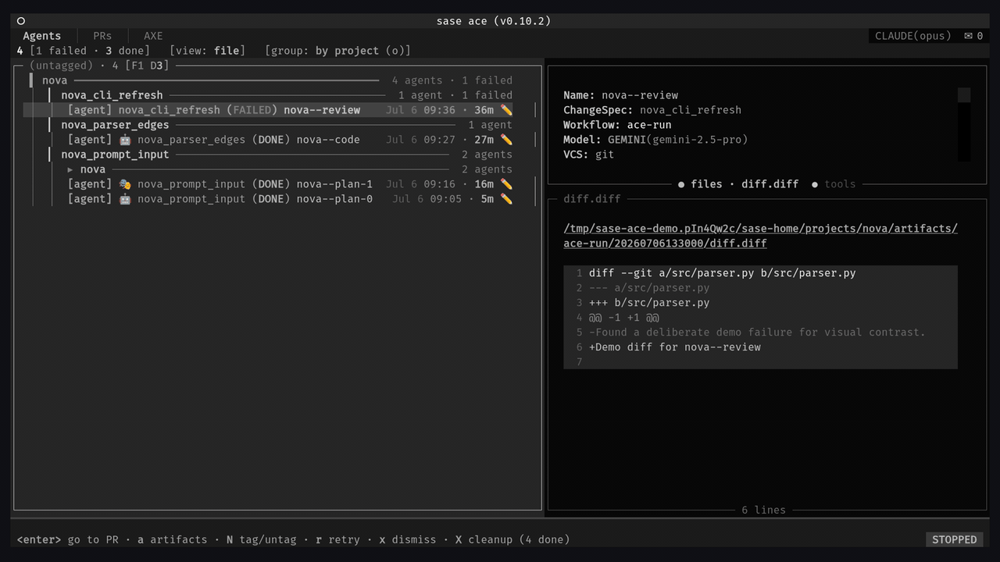

# SASE: Structured Agentic Software Engineering

The status quo is useful enough to be dangerous. Open a handful of terminal or tmux windows, run one coding-agent CLI in
each, hand each one a scoped task, and hop between them as they finish. I think of this as the Boris Cherny method
because [Boris Cherny's Claude Code setup thread](https://x.com/bcherny/status/2007179832300581177) described running
multiple Claude sessions in parallel, and Anthropic now documents
[parallel Claude Code sessions with worktrees](https://code.claude.com/docs/en/worktrees) as a normal workflow.

I automated my version of it with
[`tmux_ai_window`](https://github.com/bbugyi200/dotfiles/blob/master/home/bin/executable_tmux_ai_window), a small script
in my public dotfiles. One tmux binding opens a `display-menu` with `claude`, `codex`, `agy`, `qwen`, and `opencode`.
Each installed CLI gets an accent color and a one-key shortcut; missing CLIs are greyed out. Choosing one opens a new
window named `ai`, `ai2`, `ai3`, and so on, in the current pane's directory, with the relevant "yes, go do the work"
flags already wired. When the CLI exits, the window closes and the remaining `ai*` windows are renumbered.

That got me a long way. It also made the missing layer painfully obvious.

<!-- more -->

- 😈 The scrollback buffer is the database. Close the window, lose the run.
- 😈 No notifications. "Monitoring" means cycling windows with a thumb on `n`.
- 😈 Prompts are retyped, pasted, or fished out of shell history.
- 😈 Seven agents means seven windows and no single answer to "which one needs me?"
- 😈 One prompt launches one agent. Fan-out means typing the same thing several times.
- 😈 Plans, approvals, retries, and "what did agent 4 change?" live in your head.

SASE keeps the same five CLIs. The menu does not change. Everything around it grows up.

**SASE** (Structured Agentic Software Engineering, pronounced "sassy") is an open-source operating layer that
orchestrates coding-agent CLIs into tracked, repeatable engineering workflows. It gives agent runs durable records,
reusable prompts, scheduling, notifications, approval gates, workspace routing, and a TUI where the whole mess becomes a
screen you can read.

- 😇 Agent runs become durable records with prompts, transcripts, status, and artifacts.
- 😇 Notifications tell you when a plan, question, failure, or launch request needs attention.
- 😇 XPrompts make repeated prompts reusable and composable.
- 😇 ACE gives one control surface for many agents.
- 😇 Alternations and multi-prompt syntax launch many agents from one prompt.
- 😇 Plan and launch approvals put gates back where the human still matters.

This post is the front door: how SASE wraps agent CLIs instead of model APIs, how XPrompts work, how the Agents tab in
ACE changes the day-to-day UX, and how to install and initialize the system. The deeper engineering pieces get their own
posts.

<!-- DIAGRAM: window_farm_vs_control_tower.prompt.md — placeholder for a diagram brief contrasting tmux windows with the ACE control surface. -->

## SASE Wraps Agent CLIs, Not Models

SASE is not a model router that happens to know about coding. It is an orchestration layer around existing agent
runtimes. The [architecture guide](../../architecture.md#agent-launch-flow) describes the launch path: parse prompt text
and directives, resolve a workspace reference, expand XPrompts, invoke the selected LLM provider or workflow executor,
stream subprocess output, write agent artifacts, emit notifications, and hand review or commit work back to the VCS
layer. The [LLM provider docs](../../llms.md#provider-architecture) make the boundary explicit: providers are thin. They
construct CLI commands and run subprocesses; preprocessing and postprocessing live in SASE.

That boundary is the whole trick. SASE never has to replace Claude Code, Codex, Antigravity CLI (`agy`), Qwen Code, or
OpenCode. It launches the CLI you already installed and authenticated, then records durable state around the run:
prompt, transcript, status, workspace metadata, generated files, plans, and completion artifacts. You inherit each
provider CLI's account model, sandbox choices, tool behavior, and future improvements instead of asking SASE to clone
all of it.

The five bundled agent CLIs are exactly `claude`, `codex`, `agy`, `qwen`, and `opencode`. `agy` is Antigravity CLI. It
can route to model names that contain "Gemini", but those are model labels, not a separate `gemini` command or provider.
This distinction matters because provider names show up in commands, config, model routing, skills, and ACE rows.

Provider and model selection is still flexible per prompt. You can write `%model:codex/o3`, `%model:claude/opus`,
`%m("agy/Gemini 3.5 Flash (High)")`, or `%model:opencode/anthropic/claude-sonnet-4-5`. Known model names auto-map to
providers, and when no provider is configured SASE auto-detects installed built-ins in priority order: `claude`,
`codex`, `qwen`, `opencode`, then `agy`. For repeated workflows, model aliases such as `%model:@default` or
`%model:@blogger` let your `sase.yml` choose the concrete provider/model at launch time.

Uniformity is not just about launching. SASE skills, hooks, and commit finalization are provider-neutral by design.
`sase skill init` renders skill sources into provider-specific `SKILL.md` targets such as `~/.claude/skills/...`,
`~/.codex/skills/...`, `~/.qwen/skills/...`, and `~/.config/opencode/skills/...`. Generated provider instruction shims
are full copies of the managed `AGENTS.md`. Write the SASE workflow once; let the selected runtime execute it.

The trade-off is honest. SASE has less direct control over provider token accounting, model semantics, and low-level
tool protocols than it would have if it called raw model APIs directly. It also inherits provider pricing, policy, and
CLI behavior changes. I still prefer that bargain. The agent CLIs are where the provider-specific work is moving
fastest, and SASE is more useful as a durable control plane around them than as a second-rate replacement for them.


_One GitHub prompt fans out to Claude, Codex, and Antigravity. All three agents run in isolated workspaces and remain
controllable from the same ACE view._

<!-- DIAGRAM: one_prompt_five_clis.prompt.md — placeholder for a diagram brief showing one SASE operating layer routing to five provider CLIs. -->

## XPrompts

The smallest XPrompt is just a Markdown file. Put this in `sase/xprompts/til.md` at the project root where you run SASE:

```markdown
Append one Today-I-Learned entry to `til.md` about something useful in this workspace. Keep it to two sentences. If the
file does not exist, create it.
```

Now this is a complete launch:

```bash
sase run "#til"
```

That single `#til` reference expands into the Markdown body before the agent sees the prompt. XPrompts can live in a
project `sase/xprompts/` directory, the user-wide `~/sase/xprompts/` directory, or the `xprompts:` block in
`sase/sase.yml`; project-local definitions win when names collide. The full discovery table has more tiers for plugins
and built-ins, but day one is simple: put reusable prompts near the work, then move them outward when they become
personal tools.



_ACE prompt input expands an XPrompt reference, offers completion, and keeps the workspace prefix visible._

Typed inputs turn that Markdown file into a small interface. The reference example is deliberately boring:

```markdown
---
name: greet
description: Greet a named user.
input:
  user_name:
    type: word
    description: User name to include in the greeting.
---

Hello, {{ user_name }}! Welcome aboard.
```

The frontmatter says `user_name` is a single `word`, and the body renders it through Jinja2. You can call inputs with
parentheses (`#greet(user_name=Alice)`), a compact colon form (`#greet:Alice`), or a text shorthand that captures prose
until a blank line (`#review: check this diff for edge cases`). Bad arguments fail before a model runs, which is exactly
where argument mistakes should fail.

Directives are the other half of the language. They are `%`-prefixed controls that SASE strips before the model sees the
prompt:

```text
%model:`claude-sonnet-4-20250514`
%name:code-reviewer
%wait:planner
Review the code changes and provide feedback.
```

`%model` selects a provider/model. `%name` gives the run a durable name. `%wait` waits for another named agent or a time
floor. `%effort` sets reasoning effort where the provider supports it. `%auto` requests adapter-owned gate resolution.
`%hide` hides noisy helper runs from the default Agents view. `%repeat` repeats a prompt, and `%tribe` assigns a
user-visible tribe. Those controls live in the same Markdown as the prompt, which keeps the common case out of YAML.

Alternations are the direct answer to "one prompt equals one agent." This:

```text
%{#review | #test | #docs}
```

launches three branches. Multiple alternations form a Cartesian product, so a focus alternation paired with
`%{%m:opus | %m:sonnet}` becomes one agent per focus/model combination. For multi-model benchmarking, the prompt can be
as small as:

```text
%{%m:opus | %m:sonnet}
Review this code for edge cases.
```

For ordered multi-agent work, use literal `---` segment separators. Each segment becomes an agent, and `%wait` decides
which ones depend on earlier work:

```text
---
xprompts:
  _common: "Follow the project coding conventions."
---

%name:step1
#_common
Implement the new feature.

---

%name:step2
%wait:step1
#_common
Write tests for the new feature.
```

That launches two agents. `step2` starts after `step1` succeeds because the second segment waits on the first. YAML
workflows exist for real graphs, bash/python steps, approvals, structured outputs, and joins; do not reach for them just
because a Markdown file feels too small to be serious. Small is often the point.

There are a few special XPrompts worth knowing early. `#fork` resumes a prior agent conversation by name. Workspace refs
such as `#git:home`, `#git:<project>`, and `#gh:<owner>/<repo>` decide where the agent runs. Project XPrompts can be
namespaced, so a prompt like `#gh:sase #sase/sync` can target a repo and expand a project-specific prompt.

You type the same language in several places. `sase run` accepts it directly. The ACE prompt input adds completion
(`Ctrl+T`), fuzzy file search (`Ctrl+R`), snippets, vim-style NORMAL mode, prompt history (`Ctrl+K`), and prompt stash
(`Ctrl+S`). The [sase-nvim plugin](https://github.com/sase-org/sase-nvim) and `sase lsp` bring the same catalog to an
editor through completion, hover, diagnostics, and jump-to-definition.


_Prompt history and stashes make useful launches recoverable instead of leaving them in shell history._

<!-- DIAGRAM: prompt_burrito.prompt.md — placeholder for a funny diagram brief showing directives, workspace refs, XPrompts, and prompt text as layers. -->

## The Agents Tab In ACE

`sase ace` opens ACE, the Agentic ChangeSpec Explorer. It has three top-level tabs: **Agents**, **Artifacts**, and
**Axe**. Agents is the startup default. Artifacts has focused PRs, Commits, Bugs, and Plans sub-tabs; its PRs view owns
durable PR-sized ChangeSpec records. Axe is the background daemon view. This post stays on Agents because that is the
tmux-window-farm replacement.

The first difference is observability. The Agents tab groups runs by project, date, or status; folds and unfolds the
tree with `h`/`l` and `H`/`L`; and shows a metric strip such as
`N [S stopped · R running · W waiting · F failed · U unread · D done]` with zero-count items omitted. Each row uses
compact glyphs: `▶` for running, `✓` for done, `✎` for a submitted plan, `?` for a user question, `⏳` for waiting, `↻`
for retrying, and `⚡` for autonomous plan approval. Provider emoji badges make the runtime visible at a glance: 🎭
Claude, 🪐 Antigravity, 🤖 Codex, 🐼 Qwen, and 🐙 OpenCode.

State you used to keep in your head becomes a display. Which agent is waiting? Which one failed? Which one produced a
plan? Which completed row is still unread? Which provider/model did it use? The row already knows.


_The Agents tab groups runs, shows status/provider/model cues, and keeps the selected agent's artifacts nearby._


_A still frame makes the family grouping, selected model, and detail pane easier to inspect than the loop._

Three grouping ideas make dense views navigable. Sequential plan-chain families use `--` suffixes to keep one unit of
work together: `nova--plan`, `nova--code`, and `nova--review` render as related workflow rows under a pure family
container. Rootless `%clan:<name>` containers group hood-scoped parallel agents without changing launch order or
execution. Agent hoods use dotted names such as `foo.bar` and `foo.baz`; `~` jumps among visible ancestors, descendants,
and same-namespace neighbors. Tribes such as `@review` label related work across both structures. The point is not
taxonomy for its own sake. It is being able to collapse, revive, search, wait on, or dismiss a coherent set of agents
instead of playing guess-the-window.

ACE is also where you steer. When an agent submits a plan through `/sase_plan` or `sase plan propose`, the row enters
PLAN status and the notification carries provider/model metadata. The plan approval modal uses single keys: `a` approve
and run the coder, `r` reject, `f` request feedback, `e` edit, `t` save as a tale, and `E` make an epic. The `A` key on
an active row opens the auto-approve menu, matching `%auto`, `%auto:tale`, and `%auto:epic`.

Launch approval is the second gate. If a running agent asks SASE to launch more agents, the request becomes a priority
`LaunchApproval` notification. The modal previews the requested launch; `a` approves, `r` rejects, and `q` cancels. This
is where fan-out gets human review without making the human type every branch by hand.

The everyday verbs stay one key away: `f` forks a run, `r` edits and retries the prompt, `w` adds or removes waits, `x`
kills or dismisses, `/` opens structured agent search, and `i` opens the notifications inbox. That is the same
information density I wanted from the window farm, but with records, gates, and one keyboard.

## Install, Configure, Initialize

SASE's boring install path is the right one. You need `uv`, Python 3.12 or newer, `git` with `user.name` and
`user.email` configured, and at least one authenticated supported agent CLI: `claude`, `codex`, `agy`, `qwen`, or
`opencode`. Prebuilt `sase-core-rs` wheels are available for CPython 3.12+ on Linux x86_64, Linux aarch64, and macOS;
SASE targets POSIX platforms.

Install and check the tool:

```bash
uv tool install sase
sase version
sase doctor        # readiness gate: install, config, provider, and state report
sase core health   # confirm the required Rust core extension loaded
```

Use `uv tool install` rather than `pip install` for the normal path because `sase update`, `sase plugin install`, and
the Admin Center Updates tab all rely on uv's tool receipt. To install with GitHub support from the start:

```bash
uv tool install sase --with sase-github
```

One uv detail matters: `--with` replaces the injected plugin set instead of appending to it. To add a plugin after the
tool is installed, use `sase plugin install github` or the Admin Center.

The minimal provider config lives in `~/.config/sase/sase.yml`:

```yaml
llm_provider:
  provider: claude # or "qwen", "opencode", "agy" (default: auto-detect)
  model_tier_map:
    large: opus
    small: sonnet
  model_aliases:
    builtin:
      default: opus # model used when a prompt has no %model directive
      claude_coder: codex/gpt-5.6-sol # coder follow-ups from Claude-authored plans
      codex_coder: claude/opus # coder follow-ups from Codex-authored plans
```

Config layers are predictable: bundled defaults, plugin defaults, `~/.config/sase/sase.yml`, alphabetized `sase_*.yml`
overlays, then a project-local `sase/sase.yml` for agent-launch contexts. That gives you a global default, machine or
persona overlays, and repo-local behavior without rewriting the same block everywhere.

Initialization wires up the files agents and companion tools depend on:

```bash
sase init -c       # report drift without writing
sase init          # interactive
sase init --yes    # skip generic prompts; missing sidecar creation still asks
```

The coordinator plans in registry order: memory, repositories, then skills. Memory initialization owns the managed
`AGENTS.md` and provider instruction copies. Repository initialization owns configured sidecars, generated guides, and
the workspace ignore rule. Skill initialization renders SASE skill sources to every provider's skill directory. That is
the command-line version of the earlier promise: write the SASE workflow once, then deploy it across runtimes.

After `sase doctor` reports a usable provider, launch a read-only first run:

```bash
sase run "#git:home summarize what this repository does; do not change files"
sase agent list
sase ace
```

That is enough to see the loop: a prompt becomes an agent record, the record appears in the CLI and ACE, and the
transcript and artifacts survive the terminal window that launched it. For the guided path, use
[Getting Started](../../getting_started.md).

## What's Next

This post covered SASE's front door: provider CLIs, XPrompts, ACE's Agents tab, and the installation path. The parts
that make it an engineering system deserve their own posts: Beads and Spec-Driven Development, ChangeSpecs, hooks,
mentors, review comments, memory, Telegram/mobile control, and SASE's plugin architecture.

The quick start is still the same:

```bash
uv tool install sase
```

Docs live at [sase.sh](https://sase.sh/), source lives at [github.com/sase-org/sase](https://github.com/sase-org/sase),
and issues are welcome.
