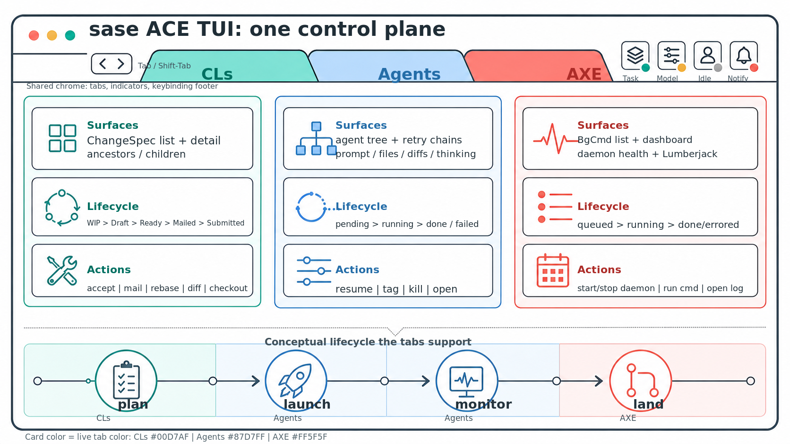

<section class="sase-hero">
  

    
SASE

    <h1>Structured Agentic Software Engineering</h1>

    

      SASE is a Python toolkit for software engineering workflows around coding agents: durable planning, tracked
      handoffs, reviewable changes, resumable runs, and provider-portable automation.
    

    

      <a class="md-button md-button--primary" href="blog/why-coding-agents-need-orchestration/">Read the launch essay</a>
      <a class="md-button" href="ace/">Start with ACE</a>
      <a class="md-button" href="series/agentic-software-engineering/">Explore the series</a>
      <a class="md-button" href="https://github.com/sase-org/sase">View on GitHub</a>
    

  

  <figure class="sase-hero__visual">
    
  </figure>
</section>

<section class="sase-section sase-section--tight">
  
Why SASE exists

  <h2>One prompt is not an engineering system</h2>

  

    A single coding-agent run can produce a patch. Real projects also need intent capture, handoff, dependency ordering,
    review state, retries, background automation, and a record of what happened. SASE provides that coordination layer
    without tying the workflow to one model provider or one terminal app.
  

</section>

<section class="sase-section">
  
Start by role

  <h2>Pick the surface that matches your work</h2>

  

  <article class="sase-card">
  <h3>I want a TUI for agent work</h3>

  
Use ACE to navigate ChangeSpecs, live agents, notifications, and automation state from one terminal interface.

<a href="ace/">Open the ACE guide</a>

  </article>

  <article class="sase-card">
  <h3>I want durable work units</h3>

  
Use ChangeSpecs and Beads to track planned work, dependencies, commits, review state, and multi-agent phase execution.

<a href="sdd/">Learn the SDD flow</a>

  </article>

  <article class="sase-card">
  <h3>I want reusable agent workflows</h3>

  
Use XPrompts and workflow specs to package prompts, scripts, provider routing, and repeatable automation.

<a href="xprompt/">Build with XPrompts</a>

  </article>
  

</section>

<section class="sase-section sase-split">
  

  
Core primitives

  <h2>The coordination model</h2>

  

    SASE keeps the work state outside the chat transcript. Agents can be scheduled, resumed, reviewed, retried, or handed
    off because the project has durable primitives for intent, execution, and automation.
  

  

  

  <ul>
    <li><strong>ChangeSpecs</strong> track CL/PR-sized work, commits, review state, comments, mentors, and lifecycle transitions.</li>
    <li><strong>Beads</strong> provide git-native issue tracking for plans, executable epics, phase dependencies, and agent handoff.</li>
    <li><strong>XPrompts</strong> turn prompt templates into reusable workflows with reference expansion and typed inputs.</li>
    <li><strong>ACE</strong> is the interactive control surface for daily work.</li>
    <li><strong>AXE</strong> runs background hooks, mentors, maintenance jobs, and scheduled workflows.</li>
    <li><strong>Provider and workspace abstractions</strong> keep the orchestration layer portable across coding agents and VCS providers.</li>
  </ul>
  

</section>

<section class="sase-section">
  
How the pieces connect

  <h2>Designed around real agent handoffs</h2>

  

  <figure>
    
    <figcaption>Component boundaries keep TUI, daemon, workflow, and provider concerns explicit.</figcaption>
  </figure>

  <figure>
    
    <figcaption>ACE gives operators one place to inspect agents, changes, notifications, and automation state.</figcaption>
  </figure>
  

</section>

<section class="sase-section">
  
Next clicks

  <h2>Move from overview to practice</h2>

  

  <article class="sase-card sase-card--compact">
  <h3>Read the launch essay</h3>

  
Why coding agents need orchestration above individual provider CLIs.

<a href="blog/why-coding-agents-need-orchestration/">Read the essay</a>

  </article>

  <article class="sase-card sase-card--compact">
  <h3>Start with ACE</h3>

  
Learn the terminal interface for day-to-day SASE work.

<a href="ace/">Open ACE</a>

  </article>

  <article class="sase-card sase-card--compact">
  <h3>Explore the series</h3>

  
Follow the agentic software engineering launch track as it grows.

<a href="series/agentic-software-engineering/">Explore the series</a>

  </article>

  <article class="sase-card sase-card--compact">
  <h3>View the code</h3>

  
Inspect the implementation, issues, and project direction.

<a href="https://github.com/sase-org/sase">Open GitHub</a>

  </article>
  

</section>

