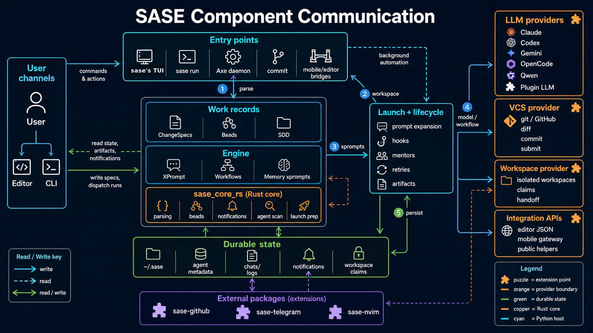

<section class="sase-hero">
  

    
SASE

    <h1>Structured Agentic Software Engineering</h1>

    

      SASE is a Python toolkit for coordinating coding-agent work: durable plans, tracked handoffs, reviewable
      changes, resumable runs, and automation that can move across model and version-control providers.
    

    

      <a class="md-button" href="getting_started/">Getting Started</a>
      <a class="md-button" href="/downloads/sase-handbook.pdf">Download PDF</a>
      <a class="md-button" href="https://github.com/sase-org/sase">View on GitHub</a>
      <a class="md-button" href="blog/posts/structured-agentic-software-engineering/">Launch Post</a>
    

  

  <figure class="sase-hero__visual">
    
  </figure>
</section>

<section class="sase-section sase-section--tight">
  
Why SASE exists

  <h2>One prompt is not an engineering system</h2>

  

    A single coding-agent run can produce a patch. Real projects also need a place to store intent, pass work between
    agents, order dependencies, track review state, retry failed runs, run background automation, and record what
    happened. SASE provides that coordination layer without tying the workflow to one model provider or one terminal app.
  

</section>

<section class="sase-section">
  
Start by role

  <h2>Pick the surface that matches your work</h2>

  

  <article class="sase-card">
  <h3>I am setting up a repo</h3>

  

    Run explicit initialization subcommands to write agent memory, refresh generated SDD guide files, and inspect,
    preview, or deploy optional provider skill files before handing work to agents.
  

<a href="init/">Open initialization</a>

  </article>

  <article class="sase-card">
  <h3>I want a TUI for agent work</h3>

  

    Use ACE, the Agentic ChangeSpec Explorer TUI, to navigate ChangeSpecs, live agents, notifications, and automation
    state from one terminal interface.
  

<a href="ace/">Open the ACE guide</a>

  </article>

  <article class="sase-card">
  <h3>I want durable work units</h3>

  

    Use ChangeSpecs for PR-sized review state and Beads for plan, epic, and phase dependencies that can drive
    multi-agent execution.
  

<a href="sdd/">Learn the SDD flow</a>

  </article>

  <article class="sase-card">
  <h3>I need shared agent memory</h3>

  

    Use instruction memory loaded through AGENTS.md, audited long-term reads, and reviewed proposals for
    agent-suggested updates.
  

<a href="memory/">Open memory</a>

  </article>

  <article class="sase-card">
  <h3>I want reusable agent workflows</h3>

  

    Use XPrompts for reusable prompt templates and workflow specs for repeatable multi-step automation.
  

<a href="xprompt/">Build with XPrompts</a>

  </article>

  <article class="sase-card">
  <h3>I want implementation context</h3>

  

    Use the architecture overview, command index, and development guide to understand the CLI surface, source layout,
    provider boundaries, and docs workflow.
  

<a href="architecture/">Read the architecture map</a>

  </article>

  <article class="sase-card">
  <h3>I want editor completions</h3>

  

    Use the xprompt LSP and editor helper bridge for prompt completion, snippets, hover, diagnostics, and
    jump-to-definition.
  

<a href="editor/">Open editor integration</a>

  </article>
  

</section>

<section class="sase-section sase-split">
  

  
Core primitives

  <h2>The coordination model</h2>

  

    SASE keeps the work state outside the chat transcript. Plans, ChangeSpecs, beads, agent artifacts, and workflow
    records let agents be scheduled, resumed, reviewed, retried, or handed off without relying on one session's context
    window.
  

  

  

  <ul>
    <li><strong>ProjectSpecs and ChangeSpecs</strong> track project lifecycle, PR-sized work, commits, review state, comments, mentors, and lifecycle transitions.</li>
    <li><strong>Beads</strong> provide git-native issue tracking for plans, executable epics, phase dependencies, and agent handoff.</li>
    <li><strong>XPrompts</strong> turn prompt templates into reusable workflows with reference expansion and typed inputs.</li>
    <li><strong>ACE</strong> is the interactive control surface for daily work.</li>
    <li><strong>Axe Automation</strong> runs background hooks, mentors, maintenance jobs, and scheduled workflows.</li>
    <li><strong>Provider and workspace abstractions</strong> route agent launches, VCS operations, and workspace setup through plugin-backed boundaries.</li>
  </ul>
  

</section>

<section class="sase-section">
  
How the pieces connect

  <h2>Designed around real agent handoffs</h2>

  

  <figure>
    
    <figcaption>Component boundaries keep TUI, daemon, workflow, and provider concerns explicit.</figcaption>
  </figure>
  

</section>

<section class="sase-section">
  
Next clicks

  <h2>Move from overview to practice</h2>

  

  <article class="sase-card sase-card--compact">
  <h3>Find a command</h3>

  
Use the CLI index to route from a command to its detailed owner page.

<a href="cli/">Open the CLI reference</a>

  </article>

  <article class="sase-card sase-card--compact">
  <h3>Understand the system</h3>

  
See how CLI, ACE, axe, workflows, providers, and the Rust core fit together.

<a href="architecture/">Open architecture</a>

  </article>

  <article class="sase-card sase-card--compact">
  <h3>Contribute locally</h3>

  
Review setup, verification commands, source layout, and docs deployment.

<a href="development/">Open development</a>

  </article>

  <article class="sase-card sase-card--compact">
  <h3>Read the launch essay</h3>

  
Why coding agents need orchestration above individual provider CLIs.

<a href="blog/posts/structured-agentic-software-engineering/">Read the essay</a>

  </article>

  <article class="sase-card sase-card--compact">
  <h3>Start with ACE</h3>

  
Learn the terminal interface for day-to-day SASE work.

<a href="ace/">Open ACE</a>

  </article>

  <article class="sase-card sase-card--compact">
  <h3>Open the blog</h3>

  
Read launch posts and longer essays as they publish.

<a href="blog/">Open the blog</a>

  </article>

  <article class="sase-card sase-card--compact">
  <h3>Download the handbook</h3>

  
Keep the current public docs and launch articles in one static PDF.

<a href="/downloads/sase-handbook.pdf">Download PDF</a>

  </article>

  <article class="sase-card sase-card--compact">
  <h3>View the code</h3>

  
Inspect the implementation, issues, and project direction.

<a href="https://github.com/sase-org/sase">Open GitHub</a>

  </article>
  

</section>

