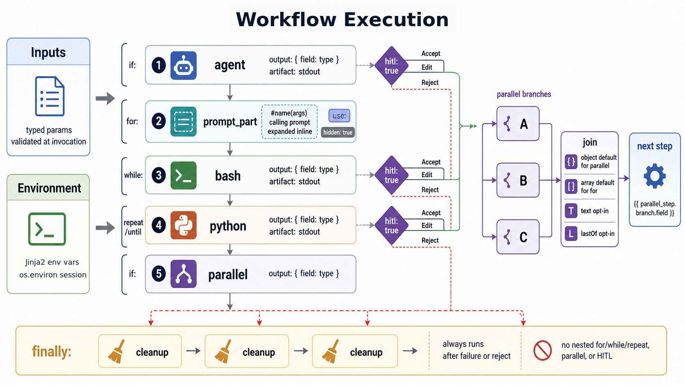

# Workflow Specification

This document describes the YAML workflow format for sase xprompt workflows. Workflows enable multi-step agent pipelines
with control flow, parallel execution, and human-in-the-loop approval.



## Table of Contents

- [Top-Level Structure](#top-level-structure)
- [Input Parameters](#input-parameters)
- [Environment](#environment)
- [Step Types](#step-types)
- [Step Imports](#step-imports)
- [Output Specification](#output-specification)
- [Artifact Passing](#artifact-passing)
- [Control Flow](#control-flow)
- [Parallel Execution](#parallel-execution)
- [Join Modes](#join-modes)
- [Template Syntax](#template-syntax)
- [Cross-Step Field Type Checking](#cross-step-field-type-checking)
- [Human-in-the-Loop](#human-in-the-loop)
- [Cleanup Steps](#cleanup-steps)
- [Examples](#examples)

## Top-Level Structure

A workflow YAML file has four top-level fields:

```yaml
name: my_workflow # Workflow identifier (optional, defaults to filename)
tags: vcs, rollover # Semantic role tags (optional)
input: # Input parameter definitions (optional)
  ...
environment: # Environment variables (optional)
  MY_VAR: "value"
steps: # Ordered list of steps (required)
  - ...
```

### Fields

| Field         | Required | Description                                                                             |
| ------------- | -------- | --------------------------------------------------------------------------------------- |
| `name`        | No       | Workflow identifier used in xprompt references. Defaults to filename without extension. |
| `tags`        | No       | Semantic role tags. See [XPrompt Tags](xprompt.md#tags) for available tags.             |
| `input`       | No       | Input parameter definitions. See [Input Parameters](#input-parameters).                 |
| `environment` | No       | Environment variables set before any steps run. See [Environment](#environment).        |
| `steps`       | Yes      | Ordered list of workflow steps to execute.                                              |

## Input Parameters

Workflows can declare typed input parameters that users provide when invoking the workflow.

### Longform Syntax

```yaml
input:
  - name: diff_path
    type: path
  - name: max_retries
    type: int
    default: 3
  - name: description
    type: text
    default: ""
```

### Shortform Syntax

```yaml
input:
  diff_path: path
  max_retries: { type: int, default: 3 }
  description: { type: text, default: "" }
```

Or even more concise for simple types:

```yaml
input: { diff_path: path, split_desc: { type: line, default: "multiple CLs" } }
```

### Supported Types

| Type    | Description                                         |
| ------- | --------------------------------------------------- |
| `word`  | Single word, no whitespace                          |
| `line`  | Single line, no newlines                            |
| `text`  | Multi-line text (any content)                       |
| `path`  | File path (no whitespace)                           |
| `int`   | Integer value                                       |
| `bool`  | Boolean value (`true`/`false`, `yes`/`no`, `1`/`0`) |
| `float` | Floating point value                                |

### Default Values

Parameters without a `default` are required. Parameters with `default: null` or `default: ""` are optional.

Default values preserve their native Python types from YAML parsing — `3` stays an `int`, `true` stays a `bool`, and
`"text"` stays a `str`. This means downstream steps receive properly typed defaults without needing explicit conversion.

## Environment

Workflows can declare environment variables that are set once before any steps run and persist for the entire agent
session. Values support Jinja2 templates rendered against the workflow's input arguments.

```yaml
name: deploy_workflow
input: { target: word }
environment:
  DEPLOY_TARGET: "{{ target }}"
  VERBOSE: "1"
steps:
  - name: deploy
    bash: echo "Deploying to $DEPLOY_TARGET"
```

Environment variables are injected into `os.environ` at workflow start, making them available to all bash, python, and
agent steps without explicit passing.

## Step Types

Each step must have exactly one of these execution types:

### Agent Steps

Execute an LLM prompt, optionally referencing inline-capable xprompts:

```yaml
- name: generate_plan
  agent: |
    #plan_generator(
      context="{{ previous_step.output }}",
      requirements="{{ requirements }}"
    )
  output: { plan: text, files: text }
```

The `agent` field contains a prompt template that can:

- Reference xprompts using `#xprompt_name(args)` syntax
- Use Jinja2 template variables: `{{ variable }}`
- Include multi-line content

Standalone workflows, which have no `prompt_part` step, cannot be embedded inside an `agent` prompt. Launch them with
`#!workflow_name(args)` at the top level or inside an anonymous wrapper prompt such as
`sase run '#gh:sase #!sase/pylimit_split %approve'`.

> **Note:** The keyword `prompt` is still accepted for backward compatibility, but `agent` is the canonical name.

### Prompt Part Steps

Inject text into the containing agent prompt without triggering a separate LLM call. When a workflow is referenced via
`#name(args)`, the `prompt_part` content is expanded inline into the calling prompt. Steps before and after the
`prompt_part` still execute as pre/post-processing.

```yaml
- name: inject
  prompt_part: |
    ---
    IMPORTANT: You should make the necessary file changes, but should NOT create a git commit.
    ---
```

This is the step type that simple `.md` xprompts are internally converted to — a single `prompt_part` step. Workflows
with a `prompt_part` step can mix it with other step types (bash, python) for pre/post-processing around an inline
prompt fragment:

```yaml
steps:
  - name: setup
    bash: git status --porcelain
    output: { status: text }
  - name: inject
    prompt_part: |
      Current git status:
      {{ setup.status }}
  - name: cleanup
    bash: echo "done"
```

> **Note:** A workflow may have at most one `prompt_part` step. It is mutually exclusive with `agent`, `bash`, `python`,
> and `parallel` within a single step.

### Bash Steps

Execute a shell command:

```yaml
- name: get_status
  bash: git status --porcelain
  output: { files: text }
```

```yaml
- name: complex_script
  bash: |
    counter_file="/tmp/counter"
    if [ ! -f "$counter_file" ]; then echo "0" > "$counter_file"; fi
    count=$(cat "$counter_file")
    echo "count=$count"
  output: { count: int }
```

### Python Steps

Execute Python code:

```yaml
- name: process_data
  python: |
    import json
    data = json.loads('{{ input_json }}')
    result = [item.upper() for item in data]
    print("result=" + json.dumps(result))
  output: { result: text }
```

Python steps run in a subprocess with access to installed packages.

### Hidden Steps

Any step can be marked `hidden: true` to suppress it from the ACE TUI Agents tab. Hidden steps execute normally but
don't appear as visible agents. This is useful for internal bookkeeping steps (e.g., report steps that emit metadata
outputs) that would clutter the agent list:

```yaml
- name: report
  hidden: true
  python: |
    import json
    print(json.dumps({"meta_commit_message": "..."}))
  output: { meta_commit_message: text }
```

### Parallel Steps

Execute multiple nested steps concurrently:

```yaml
- name: fetch_all
  parallel:
    - name: fetch_users
      bash: curl -s https://api.example.com/users
      output: { users: text }
    - name: fetch_posts
      bash: curl -s https://api.example.com/posts
      output: { posts: text }
```

See [Parallel Execution](#parallel-execution) for details.

## Step Imports

The `use` field allows reusing step definitions from shared `.yml` files in `steps/` directories. This enables
extracting common step patterns into reusable libraries.

### Syntax

```yaml
- name: my_step
  use: shared/check_changes
  output: { status: text } # Local fields override base definition
```

The `use` value is a slash-separated path relative to a `steps/` directory, without the file extension.

### Search Paths

Step definitions are resolved from the following `steps/` directories (in priority order):

1. `.xprompts/steps/` (CWD, hidden)
2. `xprompts/steps/` (CWD, non-hidden)
3. `~/.xprompts/steps/` (home, hidden)
4. `~/xprompts/steps/` (home, non-hidden)
5. `<sase-package>/xprompts/steps/` (built-in)

Both `.yml` and `.yaml` extensions are checked.

### Override Behavior

Local step fields override any fields from the base definition. The `use` field itself is stripped from the merged
result:

```yaml
# In steps/shared/lint.yml:
bash: ruff check .
output: { errors: text }

# In your workflow:
- name: lint_project
  use: shared/lint
  output: { errors: text, warnings: text }  # Overrides base output
```

### Security

Paths containing `..` or starting with `/` are rejected.

## Output Specification

Steps can declare an output schema for structured output parsing.

### Simple Object Format

```yaml
output: { field_name: type, another_field: type }
```

Example:

```yaml
- name: parse_config
  bash: echo "name=myapp\nversion=1.0"
  output: { name: word, version: word }
```

### Array Format

For steps that produce a list of objects:

```yaml
output: [{ name: word, description: text }]
```

Example:

```yaml
- name: generate_items
  agent: Generate a list of items
  output: [{ name: word, description: text, priority: { type: int, default: 0 } }]
```

### Nested Defaults

Fields can have defaults using nested dict syntax:

```yaml
output:
  name: word
  parent: { type: word, default: "" }
  priority: { type: int, default: 0 }
```

### Output Parsing

Step output is parsed in this order:

1. **JSON**: If output is valid JSON, parse and validate against schema
2. **Key=Value**: Parse lines like `key=value` into a dict
3. **Text fallback**: Store raw output as `_raw` or `_output`

For bash/python steps, output should be printed as `key=value` lines:

```bash
echo "success=true"
echo "count=42"
echo "message=Operation completed"
```

## Artifact Passing

The `artifact` field captures a step's stdout to a file, making it available to downstream steps as a file path.

### Syntax

```yaml
- name: generate_report
  bash: |
    echo "Full report content here..."
  artifact: stdout
  output: { summary: text }
```

### Behavior

When `artifact: stdout` is set:

1. The step's stdout is saved to `{artifacts_dir}/{step_name}.stdout`
2. The file path is injected as the `_artifact` field in the step's output context
3. Downstream steps can reference it via `{{ step_name._artifact }}`

### Example

```yaml
steps:
  - name: build
    bash: |
      make all 2>&1
      echo "status=success"
    artifact: stdout
    output: { status: word }

  - name: review
    agent: |
      Review the build output at {{ build._artifact }}
      Build status: {{ build.status }}
```

### Restrictions

Only `bash` and `python` steps can use `artifact`. It is **not** allowed on `agent`, `prompt_part`, `parallel`, or
nested (parallel substep) steps. The only valid value is `"stdout"`.

## Control Flow

### Conditional Execution (`if`)

Skip a step if a condition is false:

```yaml
- name: optional_step
  bash: echo "This runs conditionally"
  if: "{{ run_optional }}"
```

```yaml
- name: skip_on_failure
  bash: echo "Only runs if previous succeeded"
  if: "{{ previous_step.success }}"
```

### For Loops (`for`)

Iterate over a list:

```yaml
# Single variable
- name: process_items
  bash: echo "Processing {{ item }}"
  for: { item: "{{ items }}" }
  output: { result: text }

# Multiple parallel variables (must have equal length)
- name: process_pairs
  bash: echo "{{ name }} has id {{ id }}"
  for:
    name: "{{ names }}"
    id: "{{ ids }}"
  output: { name: word, id: int }
```

The `for` field maps variable names to Jinja2 expressions that evaluate to lists. All lists must have equal length.

### While Loops (`while`)

Execute step while a condition is true (checked after each iteration):

```yaml
# Short form
- name: poll_status
  bash: |
    status=$(check_status)
    echo "pending=$status"
  while: "{{ poll_status.pending }}"
  output: { pending: bool }

# Long form with max iterations
- name: poll_with_limit
  bash: echo "active={{ check_active }}"
  while:
    condition: "{{ poll_with_limit.active }}"
    max: 10
  output: { active: bool }
```

The step runs at least once, then continues while the condition is true. Default max iterations: 100.

### Repeat/Until Loops (`repeat`)

Execute step until a condition becomes true (do-while semantics):

```yaml
- name: retry_operation
  bash: |
    result=$(attempt_operation)
    echo "success=$result"
  repeat:
    until: "{{ retry_operation.success }}"
    max: 5
  output: { success: bool }
```

The step runs at least once, then repeats until the `until` condition is true. Default max iterations: 100.

### Combined Control Flow

`if` can be combined with `for`:

```yaml
- name: conditional_loop
  bash: echo "Processing {{ item }}"
  if: "{{ should_process }}"
  for: { item: "{{ items }}" }
```

`for` can be combined with `parallel`:

```yaml
- name: parallel_per_item
  for: { item: "[1, 2, 3]" }
  parallel:
    - name: task_a
      bash: echo "A processing {{ item }}"
    - name: task_b
      bash: echo "B processing {{ item }}"
```

## Parallel Execution

The `parallel` field runs nested steps concurrently.

### Basic Usage

```yaml
- name: parallel_tasks
  parallel:
    - name: task_a
      bash: echo "result=done_a"
      output: { result: word }
    - name: task_b
      bash: echo "result=done_b"
      output: { result: word }
```

### Accessing Results

Default join mode is `object`, nesting results under step names:

```yaml
# After parallel_tasks completes:
{{ parallel_tasks.task_a.result }}  # "done_a"
{{ parallel_tasks.task_b.result }}  # "done_b"
```

### Nested Step Restrictions

Steps within `parallel` cannot have:

- `for`, `repeat`, or `while` loops
- Nested `parallel` blocks
- `hitl: true`

### Fail-Fast Behavior

By default (`fail_fast: true`), if any parallel step fails, remaining steps are cancelled.

## Join Modes

The `join` field controls how iteration/parallel results are combined.

| Mode     | Default For | Description                                   |
| -------- | ----------- | --------------------------------------------- |
| `array`  | `for` loops | Collect results as a list                     |
| `object` | `parallel`  | Merge results into a single object            |
| `text`   | -           | Concatenate results as newline-separated text |
| `lastOf` | -           | Keep only the last result                     |

### Examples

```yaml
# Array join (default for for:)
- name: collect_results
  bash: echo "value={{ item }}"
  for: { item: "[1, 2, 3]" }
  output: { value: int }
# Result: [{"value": 1}, {"value": 2}, {"value": 3}]

# Text join
- name: concatenate
  bash: echo "line={{ item }}"
  for: { item: "['a', 'b', 'c']" }
  join: text
  output: { line: word }
# Result: "line=a\nline=b\nline=c"

# lastOf join
- name: keep_last
  bash: echo "final={{ item }}"
  for: { item: "['first', 'middle', 'last']" }
  join: lastOf
  output: { final: word }
# Result: {"final": "last"}

# Object join (default for parallel:)
- name: merge_parallel
  parallel:
    - name: a
      bash: echo "key_a=value_a"
    - name: b
      bash: echo "key_b=value_b"
# Result: {"a": {"key_a": "value_a"}, "b": {"key_b": "value_b"}}
```

## Template Syntax

Workflows use Jinja2 for template rendering.

### Variable Access

```yaml
# Input parameters
{{ parameter_name }}

# Step outputs
{{ step_name.field }}
{{ step_name.nested.field }}

# Loop variables (within for: loops)
{{ item }}
{{ name }}
```

### Filters

```yaml
# Convert to JSON
{{ data | tojson }}

# Get length
{{ items | length }}
```

### Boolean Logic

```yaml
# Conditions
{{ value and other_value }}
{{ value or fallback }}
{{ not value }}

# Defined check
{{ variable is defined }}
```

### Conditionals in Templates

```yaml
agent: |
  
  Include this text
  

  {{ "yes" if flag else "no" }}
```

## Cross-Step Field Type Checking

The workflow validator checks `{{ step_name.field }}` template references against each step's declared output schema at
load time. This catches field name typos before the workflow runs.

### What It Checks

- `{{ build.atrifact_path }}` produces an error if `build` only defines `artifact_path` in its output
- Works with parallel step nesting: `{{ parallel.nested.field }}`
- Recognizes the special `_artifact` field on steps with `artifact: stdout`
- Skips for-loop iteration variables (e.g., `item`)

### Error Format

```
Step 'deploy': references 'build.atrifact_path' but 'build' output has no field 'atrifact_path'. Available: ['artifact_path', 'status']
```

## Human-in-the-Loop

The `hitl: true` directive pauses execution for user approval.

### Basic Usage

```yaml
- name: generate_plan
  agent: Generate a migration plan
  output: { plan: text }
  hitl: true
```

### Approval Flow

When a HITL step completes:

1. Step output is displayed to the user
2. User can:
   - **Accept**: Continue to next step
   - **Edit**: Modify the output before continuing
   - **Reject**: Abort the workflow
   - **Feedback** (agent steps only): Provide feedback for regeneration
   - **Rerun** (bash/python only): Re-execute the command

### Accessing Approval Status

After a HITL step, `step.approved` indicates whether the user accepted:

```yaml
- name: prompt_user
  bash: echo "message=Continue with operation?"
  output: { message: text }
  hitl: true

- name: execute_if_approved
  if: "{{ prompt_user.approved }}"
  bash: perform_operation
```

### Restrictions

- HITL steps cannot be nested within `parallel` blocks
- HITL works with `agent`, `bash`, and `python` step types

## Cleanup Steps

Steps marked with `finally: true` run even when prior steps fail or are HITL-rejected. This is useful for cleanup and
teardown operations.

### Syntax

```yaml
steps:
  - name: setup
    bash: mkdir -p /tmp/workdir
    output: { dir: text }

  - name: main_work
    agent: Do the main work in {{ setup.dir }}
    output: { result: text }

  - name: cleanup
    finally: true
    bash: rm -rf /tmp/workdir
```

### Rules

- All `finally: true` steps must be at the **end** of the workflow, after all non-finally steps
- Cannot be used on `prompt_part` or nested (parallel substep) steps
- Can be combined with `if:` for conditional cleanup:

```yaml
- name: conditional_cleanup
  finally: true
  if: "{{ setup.dir }}"
  bash: rm -rf {{ setup.dir }}
```

## Completion Markers

When a multi-step workflow finishes, a `done.json` marker is written to track completion status. For multi-agent
workflows (workflows that spawn follow-up agents), `done.json` is written to both the current step's artifacts directory
and the root artifacts directory. The root copy ensures that:

- `%wait` dependencies resolve correctly (the workflow name is recognized as successful)
- Agent name allocation preserves the workflow's reserved name
- `find_named_agent()` can discover the completed workflow from the root

**Structure:**

```json
{
  "cl_name": "branch-name",
  "project_file": "/path/to/project.spec",
  "timestamp": "260327_143000",
  "artifacts_timestamp": "260327_143000",
  "outcome": "completed",
  "workspace_num": 1,
  "name": "agent-name",
  "model": "opus",
  "llm_provider": "claude",
  "vcs_provider": "git"
}
```

The `outcome` field is either `"completed"` or `"failed"`. Failed markers additionally include `"error"` and
`"traceback"` fields.

### Workflow-Aware Wait Success

The `%wait` directive treats a workflow dependency as satisfied only when the newest matching workflow run completed
successfully:

1. Find all agents belonging to the workflow (matching `workflow_name`)
2. Select the newest root agent (no `parent_timestamp`) when one exists
3. Require the root `done.json` outcome to be `"completed"`
4. Require every child agent for that root to have a `done.json` outcome of `"completed"`

If older artifacts only retained `workflow_name` on children and no root can be identified, the newest matching artifact
is used as a compatibility fallback, but it still must have outcome `"completed"`. Failed, killed, crashed,
still-running, malformed, or missing `done.json` artifacts do not satisfy `%wait`; the dependent agent remains waiting
until a later successful run of the same workflow name appears.

If a workflow name is not recognized (no agents with that `workflow_name`), the system falls back to single-agent
success checking with the same `"completed"` outcome requirement.

## Examples

### Complete Workflow Files

The following workflow files demonstrate these features:

- `eval_ifs_loops.yml` - Conditional execution, for loops, while/repeat loops
- `eval_parallel.yml` - Parallel execution with different join modes
- `split.yml` - Real workflow with HITL, agent steps, and xprompt references

### Minimal Example

```yaml
name: simple_workflow
input: { name: word }
steps:
  - name: greet
    bash: echo "message=Hello, {{ name }}!"
    output: { message: line }
```

### Multi-Step with Conditionals

```yaml
name: conditional_workflow
input:
  run_optional: { type: bool, default: true }
  items: { type: text, default: '["a", "b", "c"]' }

steps:
  - name: setup
    bash: echo "ready=true"
    output: { ready: bool }

  - name: process_items
    bash: echo "processed={{ item }}"
    if: "{{ setup.ready }}"
    for: { item: "{{ items }}" }
    output: { processed: word }

  - name: optional_step
    bash: echo "ran=true"
    if: "{{ run_optional }}"
    output: { ran: bool }

  - name: summary
    bash: echo "items_count={{ process_items | length }}"
    output: { items_count: int }
```

### Parallel with Dependencies

```yaml
name: parallel_workflow
steps:
  - name: fetch_data
    parallel:
      - name: users
        bash: echo "count=100"
        output: { count: int }
      - name: orders
        bash: echo "count=500"
        output: { count: int }

  - name: combine
    bash: |
      total={{ fetch_data.users.count + fetch_data.orders.count }}
      echo "total=$total"
    output: { total: int }
```

### Retry with HITL

```yaml
name: retry_workflow
steps:
  - name: attempt_operation
    bash: |
      # Simulated operation that may fail
      success=$((RANDOM % 2))
      echo "success=$success"
    repeat:
      until: "{{ attempt_operation.success }}"
      max: 3
    output: { success: bool }
    hitl: true

  - name: finalize
    if: "{{ attempt_operation.approved }}"
    bash: echo "finalized=true"
    output: { finalized: bool }
```
