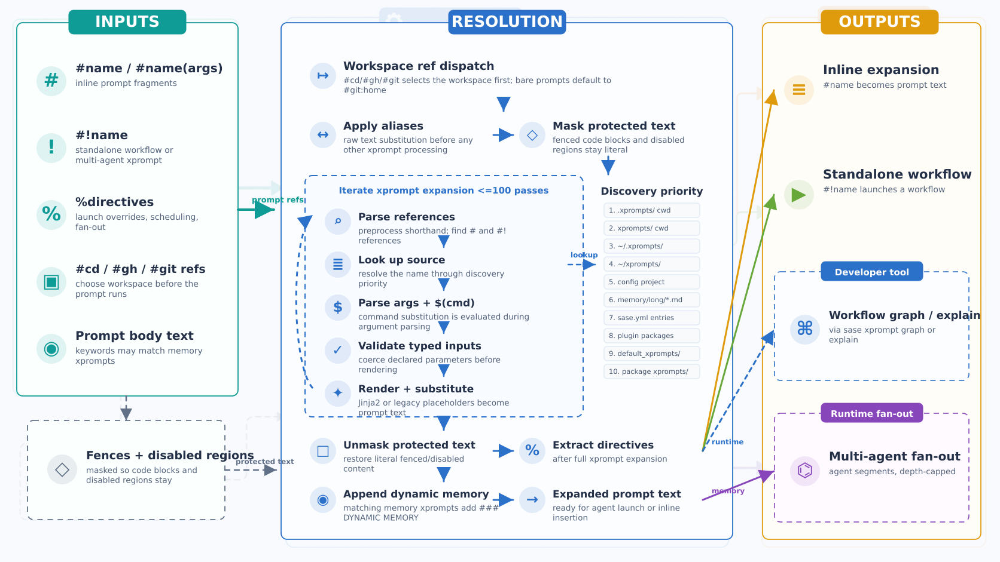

# XPrompt Template Reference

XPrompts are reusable prompt templates with optional typed inputs and Jinja2 support. They let you define a prompt
fragment once and reference it by name anywhere a prompt is composed, keeping prompts DRY and consistent across
projects. Inline prompt fragments use `#name`; standalone workflows use `#!name` when they are launched as workflows.

Use xprompts when you want to:

- Share common instructions across multiple prompts (e.g., output format rules, role definitions).
- Parameterize prompts with typed, validated arguments.
- Compose prompts from smaller building blocks using `#name(args)` syntax.

The resolution path is easiest to read as a pipeline from prompt references to final prompt text or workflow launches:



## Table of Contents

- [CLI Subcommands](#cli-subcommands)
- [Discovery Order](#discovery-order)
- [File Format](#file-format)
  - [Hooks](#hooks)
- [Reference Syntax](#reference-syntax)
- [Arguments](#arguments)
- [Shorthand Syntax](#shorthand-syntax)
- [Typed Inputs](#typed-inputs)
- [Output Specification](#output-specification)
- [Jinja2 Integration](#jinja2-integration)
- [Legacy Placeholders](#legacy-placeholders)
- [Tags](#tags)
- [Dynamic Memory (Keywords)](#dynamic-memory-keywords)
- [Snippet Field](#snippet-field)
- [Skill Field](#skill-field)
  - [Bundled Skills](#bundled-skills)
- [Built-in XPrompts](#built-in-xprompts)
- [Config-Based XPrompts](#config-based-xprompts)
- [Local Configuration Files](#local-configuration-files)
- [Directives](#directives)
- [Command Substitution](#command-substitution)
- [Protected Content](#protected-content)
- [XPrompt Aliases](#xprompt-aliases)
- [Recursive Expansion](#recursive-expansion)
- [Multi-Agent Prompts](#multi-agent-prompts)
  - [Multi-Agent XPrompts (Library-Defined Fan-Out)](#multi-agent-xprompts-library-defined-fan-out)
- [Relationship to Workflows](#relationship-to-workflows)

## CLI Subcommands

The `sase xprompt` command provides five subcommands for working with xprompts.

### `sase xprompt expand`

Expands xprompt references in a prompt. Reads from a positional argument or stdin.

```bash
sase xprompt expand '#greet(Alice)'         # Expand from argument
echo '#greet(Alice)' | sase xprompt expand  # Expand from stdin
sase xprompt expand --trace '#plan'         # Show expansion trace on stderr
```

The `--trace` flag prints a detailed expansion trace to stderr showing each resolved reference, its source file,
arguments, and expanded content. This is useful for debugging reference resolution order and understanding how a complex
prompt is assembled.

### `sase xprompt explain`

Shows a dry-run visualization of a workflow's execution plan without actually running it. Displays workflow metadata,
input requirements, resolved arguments, and the full step-by-step execution plan with types, control flow annotations,
rendered step bodies, and output schemas.

```bash
sase xprompt explain my_workflow                    # Explain with no args
sase xprompt explain my_workflow arg1 arg2          # With positional args
sase xprompt explain my_workflow --arg key=value    # With named args
```

### `sase xprompt list`

Lists all available xprompts and workflows as a JSON array. Each entry includes the name, type (`"xprompt"` or
`"workflow"`), source file path, input definitions, tags, and a content preview. Newer clients should prefer the
`kind`/`insertion` metadata when present: `simple_xprompt` and `embeddable_workflow` entries are inserted as `#name`,
while `standalone_workflow` entries are inserted as `#!name`.

```bash
sase xprompt list                   # JSON array to stdout
sase xprompt list | jq '.[].name'  # Extract just names
```

### `sase xprompt graph`

Generates a directed acyclic graph (DAG) visualization of a workflow. Without a workflow name, lists all available
multi-step workflows with their step counts and source paths.

```bash
sase xprompt graph                        # List all workflows
sase xprompt graph my_workflow            # Mermaid DAG (default)
sase xprompt graph my_workflow --format text  # Plain-text summary
```

The Mermaid output can be pasted into any Mermaid-compatible renderer. Parallel sub-steps are shown as subgraphs, and
nodes include type indicators and control flow annotations.

### `sase xprompt catalog`

Renders every visible xprompt to a formatted PDF catalog for browsing and sharing.

```bash
sase xprompt catalog                # Write the PDF to a tempdir and print its path
sase xprompt catalog --out /tmp/out # Write the PDF to the specified directory
```

The command collects all xprompts visible to the current config (same set `sase xprompt list` returns), renders each
into an HTML section, and produces a single PDF using the bundled `catalog_template.html.j2` and `catalog_style.css`.

## Discovery Order

XPrompts are loaded from multiple locations. When two locations define an xprompt with the same name, the
higher-priority source wins (first-wins).

| Priority | Location                              | Notes                                     |
| -------- | ------------------------------------- | ----------------------------------------- |
| 1        | `.xprompts/` (CWD, hidden dir)        | Highest priority; project-local overrides |
| 2        | `xprompts/` (CWD)                     | Non-hidden variant                        |
| 3        | `~/.xprompts/` (home, hidden dir)     | User-wide overrides                       |
| 4        | `~/xprompts/` (home)                  | Non-hidden variant                        |
| 5        | `~/.config/sase/xprompts/{project}/`  | Project-specific (when project is set)    |
| 6        | `sase.yml` `xprompts:` section        | Config-based definitions (local + global) |
| 7        | Plugin packages (`sase_xprompts` EPs) | Installed plugin xprompts                 |
| 8        | `<sase_package>/xprompts/`            | Built-in xprompts shipped with sase       |

Each directory (priorities 1-5, 7-8) can contain individual `.md` files. Within priority 6, the config merge chain
applies: built-in defaults, plugin configs, `~/.config/sase/sase.yml`, overlay files (`sase_*.yml`), and finally a local
`./sase.yml` in the current working directory (highest config priority).

For file-based xprompts (priorities 1-5, 7), the xprompt name defaults to the filename stem (e.g., `summarize.md`
defines the xprompt `summarize`). The name can be overridden via the `name` field in the YAML front matter.

Project-specific xprompts (priority 5) are namespaced: a file `bar.md` in the `foo` project directory becomes `foo/bar`.
Inline-capable project xprompts are referenced as `#foo/bar`; standalone project workflows are referenced as
`#!foo/bar`.

When a project is detected (via the workspace provider), CWD xprompts (priorities 1-2) and local config xprompts are
also auto-namespaced with the `{project}/` prefix. For example, if the project is `myapp` and `xprompts/deploy.md`
exists in the CWD, it becomes `myapp/deploy` and is referenced as `#myapp/deploy`. A project workflow with no
`prompt_part` would instead be launched as `#!myapp/deploy`. This prevents name collisions between project-local
xprompts and global or built-in ones.

## File Format

An xprompt file is a Markdown file with optional YAML front matter delimited by `---` lines. Everything after the
closing `---` is the template body.

```markdown
---
name: greet
input:
  user_name: word
---

Hello, {{ user_name }}! Welcome aboard.
```

### Front Matter Fields

| Field         | Required | Description                                                                    |
| ------------- | -------- | ------------------------------------------------------------------------------ |
| `name`        | No       | XPrompt name (defaults to filename stem)                                       |
| `input`       | No       | Input parameter definitions (see [Typed Inputs](#typed-inputs))                |
| `snippet`     | No       | Opt-in to ACE snippet expansion (see [Snippet Field](#snippet-field) below)    |
| `description` | No       | Human-readable one-line description of what the xprompt does                   |
| `skill`       | No       | Marks this xprompt as an agent skill source for `sase init-skills` (see below) |
| `keywords`    | No       | Trigger terms that append this xprompt as dynamic memory to matching prompts   |

If no front matter is present, the entire file content is the template body and the filename stem is the name.

## Reference Syntax

Reference inline-capable xprompts inside any prompt with the `#` prefix. Use `#!` for standalone workflows: YAML
workflows that do not have a `prompt_part` step and therefore cannot contribute inline text to a containing prompt. The
marker must appear at the start of the string, after whitespace, or after one of `([{"'`.

| Syntax                        | Description                                                    |
| ----------------------------- | -------------------------------------------------------------- |
| `#name`                       | Inline/template reference, no arguments                        |
| `#name(args)`                 | Inline parenthesis syntax with comma-separated arguments       |
| `#name:arg`                   | Inline colon syntax, passes `arg` as a single positional arg   |
| `#name:a,b,c`                 | Inline colon syntax with comma-separated multiple args         |
| `` #name:`arg with spaces` `` | Colon+backtick syntax for args containing spaces (single only) |
| `#name+`                      | Plus syntax, equivalent to `#name:true`                        |
| `#ns/name`                    | Namespaced reference (e.g., project-specific)                  |
| `#!name`                      | Standalone workflow reference, no arguments                    |
| `#!name(args)`                | Standalone workflow with parenthesized arguments               |
| `#!name:arg`                  | Standalone workflow with one colon-style positional arg        |
| `#!name!!` / `#!name??`       | Standalone workflow with an explicit HITL approval override    |

Examples:

```bash
sase run '#!sync'
sase run '#gh:sase #!sase/pylimit_split %approve'
```

During the compatibility window, top-level legacy invocations such as `sase run '#sync'` still run but emit a warning
that points to `#!sync`. Inline expansion contexts reject standalone workflows instead of passing literal `#sync` text
to the model. Shell examples should use single quotes around `#!...` so `!` is not interpreted by interactive shells.

For VCS workspace references, underscores can be used as an alternative to colons: `#gh_sase` is equivalent to
`#gh:sase`. The underscore is normalized to a colon before pattern matching, so both forms work identically. This is
useful in contexts where colons are inconvenient.

VCS references also support `@name` agent references in the ref portion. The `@name` is resolved at runtime to the named
agent's ChangeSpec (branch name), allowing one agent's prompt to target another agent's workspace:

```
#gh:@planner     resolves to e.g. #gh:planner_add_config_parser
#gh_@reviewer    same, underscore form
```

This is useful when chaining agents — for example, a review agent can target the branch created by a prior agent using
`@name` instead of hardcoding the branch name.

### VCS Workspace References

Workspace-managing workflows use the same `#name:ref` reference syntax as xprompts, but they control where the agent
runs before the rest of the prompt is executed.

| Reference    | Behavior                                                                                                |
| ------------ | ------------------------------------------------------------------------------------------------------- |
| `#cd:<path>` | Run in a local directory without reserving a numbered SASE workspace or doing VCS checkout/release work |
| `#git:<ref>` | Run in a bare-git workspace                                                                             |
| `#gh:<ref>`  | Run in a GitHub workspace, when the GitHub plugin is installed                                          |
| `#hg:<ref>`  | Run in a Mercurial workspace, when the Google plugin is installed                                       |

Prompts that do not contain a workspace reference are normalized to `#cd:~`, so a bare prompt still runs from the home
directory with no VCS workspace management. Use `#cd:/abs/path`, `#cd:relative/path`, `#cd:../sibling`, `#cd:~`, or
`#cd(.)` to choose a directory explicitly.

The raw colon form stops at whitespace, so paths with spaces should use the parenthesized form when possible:
`#cd(/tmp/my project)`. Backtick quoting is supported for ordinary xprompt arguments, but workspace-reference path
matching is intentionally conservative; prefer paths without spaces for embedded workspace tags.

Double underscores (`__`) in xprompt names are treated as forward slashes (`/`), enabling flat references to namespaced
xprompts. For example, `#foo__bar` resolves to the xprompt registered as `foo/bar`, and `#a__b__c` resolves to `a/b/c`.
Single underscores are not affected. This is useful when `/` is inconvenient in certain input contexts (e.g., shell
completion or certain prompt editors).

Markdown headings like `# Heading` are not matched because a space after `#` prevents the pattern from firing.

## Arguments

### Positional Arguments

Positional arguments are comma-separated values inside parentheses:

```
#greet(Alice)
#format(json, 4)
```

Positional arguments are mapped to input definitions by position (0-indexed).

### Named Arguments

Named arguments use `key=value` syntax:

```
#greet(user_name=Alice)
#format(style=json, indent=4)
```

Positional and named arguments can be mixed; positional arguments must come first:

```
#template(Alice, style=formal)
```

### Quoted Strings

Values containing commas or special characters can be double- or single-quoted:

```
#note("Hello, world!", priority=high)
#tag('key=value')
```

### Text Blocks

For multi-line argument values, use `[[...]]` delimiters:

```
#review([[
  This is a multi-line
  text block argument.
  Blank lines are preserved.
]])
```

Text blocks automatically strip leading whitespace from the first line and dedent continuation lines by their minimum
common indentation.

## Shorthand Syntax

Shorthand syntax converts line-oriented prompt text into `#name([[text]])` calls, avoiding the need for explicit text
block delimiters.

### Single-Colon Shorthand

`#name: text` at the start of a line captures text until a blank line (`\n\n`) or end of string:

```
#review: Please check this code for correctness
and performance issues.
```

This is equivalent to `#review([[Please check this code for correctness\nand performance issues.]])`.

### Double-Colon Shorthand

`#name:: text` captures text until the next xprompt directive at a line boundary or end of string (blank lines do not
terminate it):

```
#instructions:: Follow these rules:

1. Be concise
2. Be accurate

#review: Now review the code.
```

### Paren + Shorthand

Combine parenthesized args with shorthand text:

```
#template(style=formal): Please review the following code.
#template(style=formal):: Please review the following code.

Even across blank lines (double-colon only).
```

The text is appended as a final positional text-block argument.

## Typed Inputs

XPrompts can declare typed input parameters in the YAML front matter.

### Longform Syntax

```yaml
input:
  - name: diff_path
    type: path
  - name: max_retries
    type: int
    default: 3
```

### Shortform Syntax

```yaml
input:
  diff_path: path
  max_retries: { type: int, default: 3 }
```

### Supported Types

| Type    | Aliases   | Validation                                              |
| ------- | --------- | ------------------------------------------------------- |
| `word`  | --        | No whitespace allowed                                   |
| `line`  | --        | No newlines allowed (default type)                      |
| `text`  | --        | Any content, no restrictions                            |
| `path`  | --        | No whitespace                                           |
| `int`   | `integer` | Must parse as an integer                                |
| `bool`  | `boolean` | Accepts `true`/`false`, `yes`/`no`, `1`/`0`, `on`/`off` |
| `float` | --        | Must parse as a float                                   |

### Defaults

- An input with no `default` is required. Omitting it causes a template error if the caller does not supply a value.
- `default: null` means the YAML value was explicitly null. When `null` is passed as a positional or named argument
  value, it acts as a pass-through (the callee's own default applies).
- `default: ""` or any other value makes the input optional with that default.

## Output Specification

XPrompts used as agent steps in workflows can declare an output schema for structured output validation. See the
[Output Specification](workflow_spec.md#output-specification) section in the workflow spec for full details on the
format.

### Shortform Object

```yaml
output: { name: word, description: text }
```

### Shortform Array

```yaml
output: [{ name: word, description: text, parent: { type: word, default: "" } }]
```

### Longform

```yaml
output:
  type: json_schema
  schema:
    properties:
      name: { type: word }
      description: { type: text }
```

When an output spec is present, the agent's response is validated against the schema. Semantic types (`word`, `line`,
`text`, `path`, `bool`, `int`, `float`) are converted to JSON Schema types for validation and then checked for
additional constraints (e.g., `word` rejects whitespace).

## Jinja2 Integration

When the template body contains Jinja2 markers (`{{ }}`, ``, or `{# #}`), it is rendered as a Jinja2 template.
Arguments (both positional and named) are available in the template context.

```markdown
---
input: { user: word, verbose: { type: bool, default: false } }
---

Hello, {{ user }}.

 Here is the detailed explanation... 
```

### Template Context

| Variable           | Description                                                                                           |
| ------------------ | ----------------------------------------------------------------------------------------------------- |
| `{{ name }}`       | Named argument or input mapped by name                                                                |
| `{{ _1 }}`         | First positional argument (1-indexed)                                                                 |
| `{{ _2 }}`         | Second positional argument, etc.                                                                      |
| `{{ _args }}`      | List of all positional arguments                                                                      |
| `{{ root }}`       | Absolute path to the primary workspace directory (omitted if unresolvable)                            |
| `{{ wait_chats }}` | List of chat-transcript paths for agents named in `%wait:<name>` directives, in the order they appear |

Named arguments and positional-to-name mappings take priority; if an xprompt is called within a workflow step, the
workflow's execution scope is also available (xprompt args override scope values on conflict).

## Legacy Placeholders

For templates that do not use Jinja2 syntax, a legacy placeholder mode is available. Placeholders use `{N}` syntax
(1-indexed):

```
Review the {1} module and check for {2:correctness}.
```

- `{1}` -- required first positional argument.
- `{2:correctness}` -- second positional argument with default `correctness`.

Legacy mode is auto-detected: if the body contains no Jinja2 markers, legacy substitution is used.

## Tags

XPrompts and workflows can be annotated with semantic role tags. Tags enable lookup-by-role instead of lookup-by-name,
making the system extensible — a plugin or user can override the CRS workflow simply by defining a new xprompt with
`tags: crs`.

### Available Tags

| Tag                   | Description                                                                                                                   |
| --------------------- | ----------------------------------------------------------------------------------------------------------------------------- |
| `vcs`                 | Workspace workflow xprompt (`#cd`, `#git`, `#gh`, `#hg`) — wraps other embedded workflows, running setup/teardown around them |
| `crs`                 | Code Review Summary workflow (singleton — `get_by_tag(crs)` returns the first match)                                          |
| `fix_hook`            | Fix hook workflow (singleton — used by axe to find the hook-fix agent)                                                        |
| `rollover`            | Marks workflows whose embedded references carry forward to follow-up agent steps                                              |
| `mentor`              | Mentor review prompt workflow                                                                                                 |
| `commit`              | Commit workflow (appended by mentor review `A` key for direct commit)                                                         |
| `propose`             | Propose workflow (appended by mentor review `a` key for propose-style amend)                                                  |
| `make_mentor_changes` | Apply accepted mentor comments workflow (launched by mentor review `Enter`)                                                   |
| `diff_file`           | Injects the CL diff into the mentor prompt                                                                                    |
| `create_epic_bead`    | Plan-approval Epic flow — creates the plan file, beads, and the epic agent prompt                                             |
| `create_legend_bead`  | Plan-approval Legend flow — creates a non-executable legend-tier plan bead                                                    |
| `work_phase_bead`     | Per-phase agent prompt used by `sase bead work` (input: `bead_id`)                                                            |
| `land_epic`           | Final land-the-epic agent prompt used by `sase bead work` after all phases complete                                           |

### Defining Tags

Tags can be defined in three places:

**YAML workflow files** (`.yml`):

```yaml
tags: vcs, rollover       # comma-separated string
# or
tags: [vcs, rollover]     # list format
```

**Markdown front matter** (`.md`):

```markdown
---
name: fix_hook
tags: fix_hook
---

Fix the failing hook...
```

**Config-based xprompts** (`sase.yml`):

```yaml
xprompts:
  my_crs:
    content: "Review the code..."
    tags: [crs]
```

### Tag-Based Lookup

The `get_by_tag()` function returns the first xprompt/workflow matching a tag, respecting the standard
[discovery order](#discovery-order). This means higher-priority sources (e.g., project-local) can override built-in
tagged xprompts.

```python
from sase.xprompt.tags import XPromptTag, get_by_tag

crs_wf = get_by_tag(XPromptTag.crs)
fh_wf = get_by_tag(XPromptTag.fix_hook)
```

### Backward Compatibility

The legacy `wraps_all: true` field on workflows is still supported — it automatically adds the `vcs` tag. New workflows
should use `tags: vcs` instead.

Source: `src/sase/xprompt/tags.py`, `src/sase/xprompt/models.py`

## Dynamic Memory (Keywords)

An xprompt with a `keywords` front-matter field becomes a **dynamic memory**: whenever an agent prompt contains text
that matches one of the keywords, the memory xprompt is appended to the prompt as additional context. Matched memories
are listed in a `### DYNAMIC MEMORY` section at the bottom of the prompt (one `@<path>` entry per memory), so the agent
can load them on demand.

```markdown
---
name: memory_long_external_repos
keywords: [chezmoi, plugin]
---

Repo-layout notes for cross-repo work...
```

### Negative Keywords

Any keyword prefixed with `!` is a **negative keyword**. Before positive-keyword matching runs, each negative keyword is
matched against the prompt and its hit spans are masked out. The memory is then excluded only when every positive
keyword hit falls inside a masked region. A negative keyword that doesn't cover any positive hit is a no-op.

For example, `keywords: [foo, "!/foo/"]` matches `"update foo and /path/to/foo/"` (via the standalone `foo`) but not
`"update /path/to/foo/"` (both `foo` occurrences land inside the `/foo/` masked span).

> **YAML gotcha**: `!`-prefixed entries MUST be quoted (`"!jetski"`), otherwise YAML parses the leading `!` as a tag
> directive and raises an error at load time.

### Command Substitution Masking

Keyword matching runs **after** xprompt expansion, which means `$(cmd)` substitutions have already been replaced with
their stdout. To prevent environment-derived text (e.g. file paths emitted by `$(branch_changes ...)`) from triggering
spurious matches, every `$(...)` span — including nested parentheses — is masked to spaces before keyword matching runs.
Escaped `\$(...)` is preserved as literal text and remains eligible for matching.

## Snippet Field

XPrompts can opt-in to ACE TUI snippet expansion by setting the `snippet` field in their front matter. When set, the
xprompt's content is converted into a snippet template and merged into the ACE snippet registry at startup, so users can
expand it by typing the trigger word and pressing `Tab`.

```markdown
---
name: review
snippet: true
input:
  language: word
---

Review this {{ language }} code for correctness and style.
```

**Values:**

| Value           | Behavior                                                     |
| --------------- | ------------------------------------------------------------ |
| `true`          | Use the xprompt's base name (part after last `/`) as trigger |
| `"custom_name"` | Use the custom string as the trigger word                    |

**Conversion rules:**

- `{{ input_name }}` placeholders for required inputs become snippet tabstops (`$1`, `$2`, etc.)
- Legacy `{N}` placeholders are also converted
- XPrompts with complex Jinja2 control flow (`` or `{# #}`) are skipped
- User-defined snippets in `ace.snippets` take precedence over xprompt-derived snippets on name collision

See [docs/ace.md — Snippets](ace.md#snippets) for snippet usage in the prompt input widget.

Source: `src/sase/xprompt/snippet_bridge.py`, `src/sase/xprompt/models.py`

## Skill Field

XPrompts can be marked as agent skill sources by setting the `skill` field in their front matter. The `sase init-skills`
command reads this field to determine which xprompts should be rendered into per-provider SKILL.md files and deployed to
agent skill directories.

```markdown
---
name: sase_git_commit
skill: true
description: Commit changes using sase commit for git-based VCS
---

Commit instructions here...
```

**Values:**

| Value                  | Behavior                                        |
| ---------------------- | ----------------------------------------------- |
| `true`                 | Deploy to all providers (Claude, Gemini, Codex) |
| `["claude", "gemini"]` | Deploy only to the listed providers             |

The `description` field provides a human-readable summary shown in `sase xprompt list` output.

**Workflow:** Edit skill sources in `src/sase/xprompts/skills/`, run `sase init-skills --force`, then `chezmoi apply` to
deploy the generated files to their live locations. Do not edit deployed SKILL.md files directly.

### Bundled Skills

The following skills ship in `src/sase/xprompts/skills/` and are deployed by `sase init-skills`. Coding agents invoke
them as `/sase_<name>`:

| Skill                | Purpose                                                                                                       |
| -------------------- | ------------------------------------------------------------------------------------------------------------- |
| `sase_agents_status` | Report on currently-running sase agents (status, kill, show)                                                  |
| `sase_beads`         | Reference for `sase bead` commands (create, update, list, ready, show, dep)                                   |
| `sase_chats`         | Inspect prior sase agent chat transcripts via `sase chats list` and `sase chats show`                         |
| `sase_changespecs`   | Inspect and reason about ChangeSpecs via `sase changespec search ...`, exact-name lookup, and safe edit rules |
| `sase_git_commit`    | Commit changes for git-based VCS via `sase commit` (the only sanctioned commit path on git repos)             |
| `sase_hg_commit`     | Mercurial counterpart of `sase_git_commit` (deployed only for Gemini)                                         |
| `sase_notify`        | Inspect SASE notification inbox entries via `sase notify list` and `sase notify show`                         |
| `sase_plan`          | Submit a plan file for approval (used in lieu of disabled `EnterPlanMode`)                                    |
| `sase_questions`     | Ask the user structured questions (used in lieu of disabled `AskUserQuestion`)                                |

## Built-in XPrompts

A handful of xprompts ship in `src/sase/default_config.yml` and are always available without needing a project- or
user-level definition. They're the lowest priority in the [discovery order](#discovery-order), so any project or user
xprompt with the same name overrides them.

| Reference             | Body summary                                                                                      |
| --------------------- | ------------------------------------------------------------------------------------------------- |
| `#plan`               | Asks the agent to think the work through and use its `/sase_plan` skill before any file changes   |
| `#epic`               | Marks the request as a multi-phase epic and chains `#plan`                                        |
| `#legend`             | Marks the request as a larger legend-level planning effort that should later split into epics     |
| `#review`             | Asks the agent to fix bugs and apply only clear-win improvements                                  |
| `#prompt/approve`     | Boilerplate "I've edited the previous reply with my decisions; implement this" preamble + `#plan` |
| `#prompt/review`      | Wraps a `prompt` input and asks for a gap/ambiguity review before implementation                  |
| `#research`           | Tells the agent to store research in a new `sdd/research/` markdown file                          |
| `#research/more`      | Asks the agent to improve an existing research markdown file by filling missed gaps               |
| `#research/prompt`    | Wraps a `prompt` input and asks for prior art, alternatives, and a recommended solution           |
| `#x:name,cmd`         | Saves a freeform `sase_xcmd` command to the prompt (`@$(sase_xcmd <name> <cmd>)`)                 |
| `#bd/new_epic`        | Multi-phase epic kickoff used by `sase bead work` (resolved via `XPromptTag`)                     |
| `#bd/new_legend`      | Legend kickoff that creates a `legend`-tier plan bead without running `sase bead work`            |
| `#bd/work_phase_bead` | Per-phase agent prompt used by `sase bead work`                                                   |
| `#bd/land_epic`       | Final land-agent prompt used by `sase bead work`                                                  |
| `#bd/next`            | "What should I work on next?" helper that consults the bead tracker                               |
| `#bd/review/plan`     | Plan-review helper for an epic plan                                                               |
| `#bd/review/prompt`   | Prompt-review helper for an epic plan                                                             |

`#bd/new_epic` accepts optional ChangeSpec metadata for the plan bead it creates:

```text
#git:sase #bd/new_epic(plan_file_path=sdd/epics/202604/example.md, changespec=sase_feature, bug_id=12345)
```

When `bug_id` is supplied, `changespec` must also be supplied; the generated plan bead is created with the corresponding
`sase bead create -c/--changespec` and `-b/--bug-id` metadata.

`#bd/new_epic` also accepts an optional `legend_bead_id`. When supplied, or when the epic plan file frontmatter contains
`legend_bead_id`, the epic is linked under that legend with `--type plan(<plan_file>,<legend_bead_id>) --tier epic`.
`#bd/new_legend` creates a `--tier legend` plan bead for `sdd/legends/{YYYYMM}/...` and does not run `sase bead work`.

To see the exact body of any built-in inline xprompt, run `sase xprompt expand --trace '#<name>'` or browse the catalog
with `sase xprompt catalog`. Use `sase xprompt explain <name>` for workflows; the explain command takes the workflow
name without a `#` or `#!` marker.

### Bundled Standalone Workflows

The repo-level `xprompts/` directory also ships standalone YAML workflows that are normally invoked with `#!`:

| Reference              | Inputs   | Purpose                                   |
| ---------------------- | -------- | ----------------------------------------- |
| `#!sase/fix_just`      | none     | Repair or validate `just` workflow issues |
| `#!sase/pylimit_split` | `limits` | Assist with Python file-size splitting    |

The scheduled documentation refresh workflow is configured globally as `#!refresh_docs` in `sase_athena.yml`, not as a
repo-local project-namespaced workflow. It accepts `project`, `gh_ref`, and `threshold`, defaulting to the main `sase`
repo behavior (`project=sase`, `gh_ref=sase`, `threshold=50`). For scheduled checks in sibling repos, pass repo-specific
values such as `#!refresh_docs(project=sase-core, gh_ref=sase-org/sase-core, threshold=25)`. The `project` input selects
the marker path under `~/.sase/projects/<project>/refresh_docs_marker`; `gh_ref` is forwarded to the nested docs agent
as `#gh:<gh_ref>`.

## Config-Based XPrompts

XPrompts can be defined inline in `sase.yml` under the `xprompts:` key.

### Simple Format

```yaml
xprompts:
  propose: "Please propose your changes before applying them."
```

### Structured Format

```yaml
xprompts:
  greet:
    input: { name: word, count: { type: int, default: 1 } }
    content: "Hello {{ name }}, count is {{ count }}"
```

Config-based xprompts have priority 6 (below file-based, above plugin and built-in).

## Config-Based Standalone Workflows

Standalone workflows can be defined in config files under the top-level `workflows:` key and invoked with `#!name`.
Their schema matches YAML workflow files:

```yaml
workflows:
  refresh_docs:
    input:
      project: { type: line, default: "sase" }
    steps:
      - name: run
        bash: echo "{{ project }}"
```

Config workflows have the same precedence band as config xprompts: below file-based and project-specific workflows,
above plugin and built-in workflows. Workflows from local `./sase.yml` are namespaced when a project is detected;
workflows from user config and `sase_*.yml` overlays remain global.

## Local Configuration Files

You can define project-specific xprompts in a `sase.yml` file in the current working directory. This is a full sase
config file that can override any configuration, including xprompts. It is the highest-priority config source in the
[deep-merge system](configuration.md#deep-merge-system), overriding global `sase.yml`, overlay files, plugin configs,
and built-in defaults. Individual `.md` files in xprompts directories still take precedence over config-defined
xprompts.

```yaml
xprompts:
  # Simple format — value is the template body
  propose: "Please propose your changes before applying them."

  # Structured format — with typed inputs and/or output
  greet:
    input: { name: word, count: { type: int, default: 1 } }
    content: "Hello {{ name }}, count is {{ count }}"
```

## Directives

Directives are in-prompt tags with a `%` prefix that modify agent runner behavior. They are extracted and stripped from
the prompt before further processing.

### Supported Directives

| Directive  | Alias | Description                                               |
| ---------- | ----- | --------------------------------------------------------- |
| `%model`   | `%m`  | Override the LLM model for this prompt                    |
| `%name`    | `%n`  | Assign a name to the agent                                |
| `%wait`    | `%w`  | Wait for another agent or a duration (can repeat)         |
| `%hide`    | `%h`  | Hide the agent from the default Agents tab display        |
| `%approve` | `%a`  | Run the agent fully autonomously (skip approval)          |
| `%plan`    | `%p`  | Enable plan mode (plan first, then execute)               |
| `%edit`    | `%e`  | Return editor text to the prompt bar for review           |
| `%repeat`  | `%r`  | Run the prompt multiple times (e.g., `%repeat:3`)         |
| `%tag`     | `%t`  | Assign the agent's user-managed tag (e.g., `%tag:review`) |
| `%alt`     | `%(`  | Split prompt into variants with different text            |

### Syntax

Directives use the same argument syntax as xprompt references:

```
%model:claude-sonnet         # Colon syntax
%model(claude-sonnet)        # Parenthesis syntax
%model:`claude-sonnet-4`     # Backtick syntax (for values with special chars)
%model:codex/o3              # Provider/model syntax — switches both provider and model
%model:gemini/gemini-2.5-pro # Provider/model syntax for Gemini
%name:reviewer               # Short-form
%n:reviewer                  # Same, using alias
%name                        # Bare — auto-generates a unique name
%wait:agent1                 # Wait for agent1
%w:agent2                    # Wait for agent2 (alias)
%wait                        # Bare — waits for the most recently named agent
%wait:5m                     # Wait for 5 minutes before starting
%wait:1h30m                  # Wait for 1 hour 30 minutes
%wait:90s                    # Wait for 90 seconds
%wait:1430                   # Wait until 14:30 today (wraps to tomorrow if past)
%wait:260415/0900            # Wait until 2026-04-15 at 09:00
%wait:agent1,agent2,5m       # Multi-value: equivalent to three separate %wait: lines
%wait(agent1, agent2, 5m)    # Same, paren form
%repeat:3                    # Run the prompt 3 times
%r:5                         # Same, using alias
%alt(#review,#test)          # Split into two prompts: one with #review, one with #test
%(#review,#test)             # Same, using shorthand syntax
%alt(sec=#review,perf=#test) # Named variants become child name suffixes
%alt(extra instructions)     # Single arg: split into with/without variants
%(extra instructions)        # Same, using shorthand
%approve                     # Run fully autonomously
%a                           # Same, using alias
%edit                        # Return editor text to prompt bar
%e                           # Same, using alias
%plan                        # Enable plan mode
%p                           # Same, using alias
%tag:review                  # Assign the tag "review" to this agent
%t:review                    # Same, using alias
```

The `%model` directive also supports automatic provider resolution: known model names (e.g., `opus`, `o3`,
`gemini-2.5-pro`) are automatically mapped to their provider. See
[Per-Prompt Provider Switching](llms.md#per-prompt-provider-switching) for the full model-to-provider mapping.

The `%name` and `%wait` directives can be used without arguments. Bare `%name` auto-generates a unique name for the
agent. Bare `%wait` resolves to the most recently named agent (raises an error if no previous agent exists).

The `%wait` directive also accepts duration arguments in `XhYmZs` format (e.g., `%wait:5m`, `%wait:1h30m`, `%wait:90s`).
Duration waits delay the agent's start by the specified amount. When a prompt contains both agent-name waits and
duration waits, the agent waits for all named agents to complete and then waits for the remaining duration (the maximum
duration is used if multiple are specified).

The `%wait` directive additionally accepts absolute time arguments:

- **`HHMM`** — wait until that time today (e.g., `%wait:1430` for 14:30). If the time has already passed, it wraps to
  tomorrow.
- **`yymmdd/HHMM`** — wait until a specific date and time (e.g., `%wait:260415/0900` for 2026-04-15 at 09:00). Raises an
  error if the target is in the past.

Absolute time waits cannot be combined with duration waits or with each other. They can, however, be combined with
agent-name waits.

Multi-value directives (`%wait`, `%model`, `%alt`) accept comma-separated arguments to collapse what would otherwise be
several lines: `%wait:agent_a,agent_b,5m` is equivalent to three separate `%wait:` directives. Backtick-quoted values
(e.g. `` %wait:`a,b` ``) are treated as a single literal and not split on commas.

The `%approve`, `%edit`, and `%plan` directives are boolean flags — they take no arguments and are simply present or
absent.

### Example

```
%model:`claude-sonnet-4-20250514`
%name:code-reviewer
%wait:planner
Review the code changes and provide feedback.
```

The directives are stripped from the prompt text. The agent will use the specified model, be named "code-reviewer", and
will wait for the "planner" agent to complete before running.

### Hide Directive

The `%hide` directive marks an agent as hidden. Hidden agents are not shown in the Agents tab by default — press `.` to
toggle their visibility. This is useful for background agents spawned by axe or workflows that don't need active
monitoring:

```
%hide
%name:background-checker
Run periodic health checks.
```

### Approve Directive

The `%approve` directive marks an agent as fully autonomous. The agent runs without requiring human approval for plan
steps or other checkpoints that would normally pause for user input:

```
%approve
%name:auto-fixer
Fix the lint errors in the codebase.
```

### Edit Directive

The `%edit` directive causes the editor text to be loaded into the ACE prompt input bar instead of being submitted
directly. This lets you compose a prompt in `$EDITOR` (via `Ctrl+G`) and then review or tweak it in the prompt bar
before launching an agent:

```
%edit
Refactor the parser module to use dataclasses.
```

When the editor closes, the `%edit` directive is stripped and the remaining text appears in the prompt input bar for
further editing. The agent is not launched until you press Enter in the prompt bar.

### Plan Directive

The `%plan` directive enables plan mode for the agent. The agent first creates a plan and pauses for user approval
before proceeding with execution. In the TUI, the agent shows a PLANNING status while creating the plan, then PLAN
APPROVED once the user approves it:

```
%plan
%name:refactorer
Refactor the authentication module to use the new middleware.
```

Once the plan is approved, sase launches a follow-up **coder** agent using the same handoff body as the `#coder`
built-in xprompt (see [sase/xprompts/coder.md](../src/sase/xprompts/coder.md)). `#coder` takes the approved plan file as
its `plan_file` input, injects it with `@`, and instructs the agent to implement the plan. By default the coder does
_not_ inherit the planner's chat transcript — the plan file is the hand-off artifact. Set
`SASE_CODER_INHERIT_PLANNER_CHAT=1` to restore the old behavior, in which case a `#resume:<planner_name>` reference is
prepended to the coder prompt so it resumes the planner's session.

### Repeat Directive

The `%repeat` directive runs the same prompt multiple times. The argument is a positive integer specifying the repeat
count:

```
%repeat:3
%name:linter
Run lint checks on the codebase.
```

This launches 3 independent agents — each spawned with its own process, workspace, and `agent_meta.json`, appearing as
its own top-level entry in the Agents tab. Fan-out happens at launch time: the directive is consumed when the agents are
spawned, so there is no outer loop or TUI affordance ticking through iterations. The slot numbers are appended to the
`%name` base (`linter.1`, `linter.2`, `linter.3`); when `%name` is omitted the auto-assigned base is used (e.g. `a.1`,
`a.2`, `a.3`).

Iterations run **sequentially**: all N agents are spawned up front and register immediately in the TUI, but iteration
`k+1` is automatically wait-chained behind iteration `k` via an injected `%wait:<prev_name>` directive. This turns
`%repeat` into a serial iteration primitive — each iteration can observe its predecessor's work — without blocking the
launcher on any single agent.

Each iteration exposes two iteration-scoped named arguments in the agent's workflow:

| Variable | Meaning                                   | Example with `%repeat:5` |
| -------- | ----------------------------------------- | ------------------------ |
| `n`      | Current iteration (1-based)               | 1, 2, 3, 4, 5            |
| `N`      | Total iterations (the `%repeat` argument) | 5                        |

These are threaded through via the `SASE_REPEAT_ITERATION` and `SASE_REPEAT_TOTAL` environment variables — the agent
runner reads them, converts to ints, and passes them as named args into the workflow so they appear as Jinja2 variables
in the prompt body:

```
%repeat:5
Run test suite batch {{ n }} of {{ N }}.
```

### Alt Directive

The `%alt` directive splits a single prompt into multiple variant prompts, each launched as a separate agent. Each
comma-separated argument replaces the directive span in the output prompt:

```
%alt(#review,#test,#docs)
Analyze the codebase.
```

This produces three agents, each with "Analyze the codebase." but with `#review`, `#test`, or `#docs` substituted in
place of the directive. Arguments can be arbitrary text — xprompt references, directives, plain instructions, or
`[[text blocks]]`.

Arguments can also be named with `id=value`. The `value` is inserted into the spawned prompt and the `id` becomes the
child agent suffix. For example, `%name:review %alt(sec=[[security]],perf=[[performance]])` launches `review.sec` and
`review.perf`. Unnamed alternatives use numeric suffixes while skipping any numeric ids already provided by named
arguments, so `%(2=[[named]], [[first]], [[second]])` launches suffixes `2`, `1`, and `3`.

`%(...)` is syntactic sugar for `%alt(...)`:

```
%(#review,#test)
Analyze the codebase.
```

A single-argument `%alt` is treated as a with/without split — it produces two prompts: one with the argument text and
one with the directive removed entirely:

```
%(Also check for security issues.)
Review this module.
```

This launches two agents: one with "Also check for security issues. Review this module." and one with just "Review this
module."

Multiple `%alt`/`%(` directives can appear in the same prompt. When they do, a **Cartesian product** of all argument
lists is computed — one agent is launched per combination:

```
%(Focus on security, Focus on perf) %m(opus, sonnet)
Review this code.
```

This produces 2 × 2 = 4 agents (every focus area paired with every model). The multi-model directive (`%m(opus,sonnet)`)
is internally rewritten as `%alt(%model:opus,%model:sonnet)`, so it participates in the Cartesian product naturally.

### Multi-Model Directive

The `%model` directive supports launching multiple agents in parallel — one per model — when given comma-separated model
names in parentheses:

```
%m(opus,sonnet)
Review this code for edge cases.
```

This launches two agents with identical prompts, each using a different model. Each agent appears as a separate entry in
the Agents tab. Only the parenthesized syntax triggers multi-model behavior; colon syntax (`%m:opus`) and single-model
parentheses (`%m(opus)`) always launch a single agent.

When a prompt fans out to multiple models, the spawned agents share a single base name and carry a runtime suffix so
they can be told apart at a glance. Given `%m(opus,gpt-5.5) %n:foo`, the two agents are named `foo.cld` and `foo.cdx`.
The runtime suffix is a short alias declared by the provider plugin (via the `llm_provider_short_name` hook) — `cld`,
`cdx`, `gem` for the built-in providers (`jet` ships in the `sase-google` plugin) — falling back to the full provider
name for plugins that don't declare one. If `%name` is omitted, a single auto-generated base is allocated and shared
(e.g. `a.cld` / `a.cdx`) rather than each agent picking its own letter independently. Single-model prompts retain their
plain `%name` value unchanged. When two models share a runtime (e.g. `%m(opus,sonnet)` — both `claude`), the model name
disambiguates the suffix: `foo.cld-opus` and `foo.cld-sonnet`. Long model names (e.g. `gemini-3-flash-preview`) are
replaced with a short alias (`flash3`) declared by the provider plugin, so a same-runtime gemini fan-out reads as
`foo.gem-flash3` / `foo.gem-flash25` rather than echoing the full model string. Model arguments used for naming are
first resolved through xprompt shorthand expansion, while the launched prompt keeps the original `%model` value. For
example, `%n:ag %m(#flash,#pro)` can launch agents named `ag.gem-flash3` and `ag.gem-pro31p`.

### Multi-Value Directives

The `%wait` directive supports multiple occurrences — each adds to the wait list:

```
%wait:agent1
%wait:agent2
%wait:agent3
Do work after all three agents finish.
```

Agent names and durations can be mixed freely:

```
%wait:agent1
%wait:5m
Wait for agent1 to finish, then wait at least 5 minutes from launch.
```

## Command Substitution

XPrompt arguments support shell command substitution using `$(cmd)` syntax. The command is executed via the shell and
its output replaces the `$(cmd)` expression.

```
#bug:$(branch_bug)           # Use output of branch_bug command as the argument
#review:$(git diff HEAD~1)   # Pass git diff output as argument
```

Nested parentheses are supported: `$(echo $(date))`. To include a literal `$(`, escape it as `\$(`.

Failed commands or commands producing empty output result in an empty string replacement. Command outputs are cached
within a single expansion pass to avoid redundant execution.

## Protected Content

### Fenced Code Blocks

Content inside triple-backtick fenced code blocks is automatically protected from xprompt expansion:

````
Here's an example:

```
#foo will NOT be expanded inside this code block
```

But #foo HERE will be expanded normally.
````

This prevents accidental expansion of `#name` patterns in code examples, documentation, and similar content.

### Disabled Regions

You can explicitly disable xprompt expansion for a region of text using the `%xprompts_enabled` directive:

```
%xprompts_enabled:false
This content is passed through verbatim.
#foo will NOT be expanded here.
%xprompts_enabled:true
Normal expansion resumes here.
#foo WILL be expanded.
```

The markers are stripped from the final output. This is useful for embedding raw xprompt syntax in documentation or for
passing literal `#name` patterns to downstream consumers.

The closing `%xprompts_enabled:true` marker may appear either on its own line or **inline** at the end of a content
line. In both forms the marker (and any whitespace immediately preceding an inline marker) is stripped from the final
output, so prompts authored as natural prose can re-enable expansion mid-line:

```
%xprompts_enabled:false
... raw content where #foo and @bar are passed through verbatim. %xprompts_enabled:true
And expansion resumes here.
```

## XPrompt Aliases

XPrompt aliases provide raw text-level substitution that runs _before_ any other xprompt processing. They are defined in
the `xprompt_aliases` config field in `sase.yml`.

The built-in defaults provide two shorthand aliases:

| Alias | Target    | Usage             |
| ----- | --------- | ----------------- |
| `c`   | `commit`  | `#c` → `#commit`  |
| `p`   | `propose` | `#p` → `#propose` |

Additional aliases can be added in user config files:

```yaml
xprompt_aliases:
  gh_sase: "gh:sase" # #gh_sase → #gh:sase
  gh_foo: "gh:foo/bar" # #gh_foo  → #gh:foo/bar
```

When the processor encounters `#alias_name` in a prompt, it replaces the alias name portion with the target string
before any xprompt resolution occurs. This is particularly useful when the target contains characters (like `:`) that
must be present in the raw text for other processing logic — such as VCS directory-switching — to work correctly.

See [Configuration Reference: xprompt_aliases](configuration.md#xprompt_aliases) for the full field specification.

## Recursive Expansion

XPrompt bodies can reference other xprompts. Expansion is iterative: after each round of substitution, the result is
scanned again for new `#name` references. This continues until no known references remain, up to a maximum of 100
iterations (to guard against circular references).

## Multi-Agent Prompts

A single prompt can launch multiple agents sequentially by using YAML frontmatter and `---` segment separators. The same
`---`-separator convention also applies inside an xprompt body — see
[Multi-Agent XPrompts (Library-Defined Fan-Out)](#multi-agent-xprompts-library-defined-fan-out) below.

### Frontmatter-Defined Local XPrompts

YAML frontmatter at the start of a prompt can define local xprompts under the `xprompts:` key. These are defined once in
the frontmatter and each segment receives only the local xprompts it actually references (including transitive
dependencies). Local xprompt names **must** start with `_` to distinguish them from global xprompts.

```
---
xprompts:
  _review_rules: "Always check for error handling and edge cases."
---
#_review_rules
Review the authentication module.
```

Local xprompts support the same structured format as config-based xprompts (typed inputs, Jinja2 content):

```
---
xprompts:
  _template:
    input: { target: word }
    content: "Review the {{ target }} module."
---
#_template(auth)
```

### Segment Separators

After the frontmatter block is consumed, subsequent `---` lines on their own act as segment separators. Each segment
launches a separate agent sequentially:

```
---
xprompts:
  _common: "Follow the project coding conventions."
---
%name:step1
#_common
Implement the new feature.
---
%name:step2
%wait:step1
#_common
Write tests for the new feature.
```

This launches two agents: `step1` runs first, then `step2` starts after `step1` completes (via `%wait`). Both agents
share the `_common` local xprompt.

### Rules

- The first `---` pair at the start of the document is treated as YAML frontmatter.
- After frontmatter is consumed, all subsequent `---` lines are segment separators.
- If there is no frontmatter, ALL `---` lines are segment separators.
- A prompt with frontmatter but only one segment is a single-agent prompt with local xprompts (not multi-agent).
- `---` inside fenced code blocks is not treated as a separator.
- When a multi-agent prompt is saved to prompt history, each individual segment is also saved as a separate entry. This
  allows segments to appear independently in the prompt history picker for reuse.

### Multi-Agent XPrompts (Library-Defined Fan-Out)

An xprompt itself can be a "multi-agent xprompt": its body contains `---` separators (outside fenced blocks), and
referencing it as the sole content of a user-prompt segment fans the call out into one agent per body segment. The
spawned agents share the same input arguments — each segment is rendered with the same `(args)` substituted in. These
markdown-defined fan-out xprompts still use `#name`; do not switch them to `#!name`.

```
# xprompts/three_phase.md
---
input:
  target: word
---
%name:plan
Draft a plan for {{ target }}.
---
%name:code
%wait:plan
Implement {{ target }} following the plan.
---
%name:review
%wait:code
Review the {{ target }} implementation and propose follow-ups.
```

Invoking it:

```bash
sase run '#three_phase(login)'
```

…dispatches three agents (`plan`, `code`, `review`), each receiving `target=login`. The `%wait` directives chain them
sequentially; without `%wait` they would run in parallel.

Detection happens at dispatch time (after standard `parse_multi_prompt`), in `src/sase/agent/multi_agent_xprompt.py`,
and applies at every dispatch site (`sase run`, the TUI agent launcher, the query handler).

#### Rules and Limitations

- A multi-agent xprompt reference must be the **only** content in its user-prompt segment. Mixing the reference with
  other prose raises a usage error — split your prompt manually if you need surrounding text.
- Fan-out is one level deep. An inline `#name(args)` reference **inside another xprompt's body** is NOT re-split into
  segments; it is expanded by the agent runner's normal xprompt expansion as a single block.
- `---` inside fenced code blocks in the xprompt body is not treated as a separator.
- Recursive fan-out (a multi-agent xprompt body whose own segments reference more multi-agent xprompts) is bounded by a
  depth cap and will raise if exceeded.

## Relationship to Workflows

XPrompts and [workflows](workflow_spec.md) share the same argument grammar, but the marker communicates how the
reference is allowed to participate in a prompt:

- `#name(args)` expands inline-capable xprompts and workflows with a `prompt_part` step.
- `#!name(args)` launches standalone YAML workflows that have no `prompt_part` step.

Simple markdown xprompts are converted internally to single-step workflows with a `prompt_part` step, so they remain
inline-capable and continue to use `#name`.

Workflow agent steps can embed xprompt references inline:

```yaml
steps:
  - name: review
    agent: |
      #mentor(prompt=[[Review error handling]])
```

See the [Workflow Specification](workflow_spec.md) for full details on multi-step workflows, control flow, parallel
execution, and human-in-the-loop approval.
