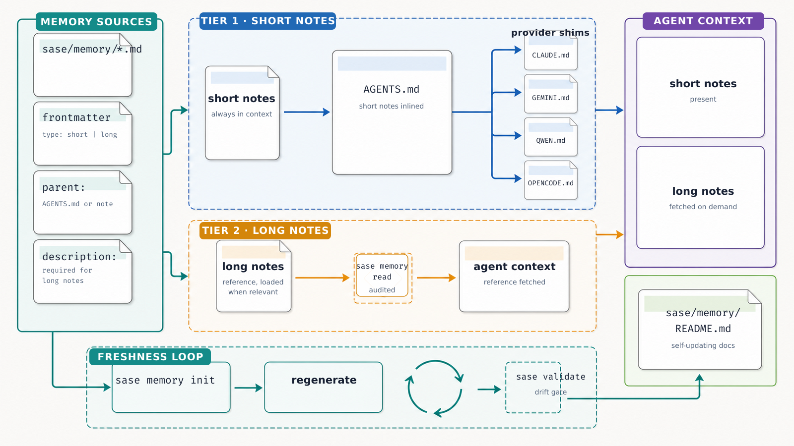

# SASE Memory

The `sase/memory/` directory holds agent-facing project context. It separates compact,
always-loaded notes from detailed reference notes that agents read only when relevant.

## How Memory Files Are Used

- Non-README Markdown files live directly under `sase/memory/` and use YAML frontmatter
  for `type`, `parent`, and `description`.
- `type: short` notes are Tier 1 context. `sase memory init` inlines them into
  `AGENTS.md`, then copies that exact content to each provider instruction shim.
- `type: long` notes are detailed reference material for Tier 2. They require a
  `description` and are fetched explicitly with audited `sase memory read` calls.
- `sase/memory/sase.md` is always generated by SASE and captures linked repositories
  plus workspace rules. SASE-managed project repositories also generate
  `sase/memory/sase_beads.md` for shared bead workflow guidance and
  `sase/memory/sase_sizes.md` for size guidance.
- `sase/memory/README.md` is generated from the notes themselves, including the
  statistics below.

### Frontmatter Schema

- `type`: `short` for always-loaded notes or `long` for read-on-demand reference notes.
- `parent`: `AGENTS.md` for top-level notes, or `sase/memory/<note>.md` when a long note
  belongs under another long note.
- `description`: required for long notes and used in generated agent instructions and
  this README. Long-note descriptions may be Markdown blocks authored as YAML literal
  block scalars; Tier 2 sections render those blocks verbatim, while single-line
  surfaces collapse them.

### Linking

- `@sase/memory/<note>.md` loads a note into agent context when the root instruction
  file is read.
- Plain `sase/memory/<note>.md` mentions keep a note discoverable without loading it
  automatically.
- Long notes parented under another long note are reachable through that parent for
  validation.

### Canonical And Legacy Roots

- Project memory is written to `<project>/sase/memory/`; home memory is written to
  `~/sase/memory/`.
- Legacy project `memory/` and home `~/memory/` trees are read only for migration
  compatibility.
- Canonical and legacy trees are never merged. Non-identical coexistence blocks
  initialization; identical legacy trees can be removed during a safe initialization
  pass.

## Memory Notes

### `sase/memory/build_and_run.md`

- Type: `short`
- Description: No description set.
- Parent: `AGENTS.md`
- Lines: 56
- Approx. tokens: 727

### `sase/memory/feature_flags.md`

- Type: `short`
- Description: No description set.
- Parent: `AGENTS.md`
- Lines: 14
- Approx. tokens: 127

### `sase/memory/gotchas.md`

- Type: `short`
- Description: No description set.
- Parent: `AGENTS.md`
- Lines: 33
- Approx. tokens: 428

### `sase/memory/rust_core_backend_boundary.md`

- Type: `short`
- Description: No description set.
- Parent: `AGENTS.md`
- Lines: 18
- Approx. tokens: 188

### `sase/memory/sase.md`

- Type: `short`
- Description: No description set.
- Parent: `AGENTS.md`
- Lines: 71
- Approx. tokens: 892

### `sase/memory/cli_rules.md`

- Type: `long`
- Description: Read anytime new CLI subcommands or options are added.
- Parent: `AGENTS.md`
- Lines: 35
- Approx. tokens: 425

### `sase/memory/generated_skills.md`

- Type: `long`
- Description: Read when working with sase agent skills (aka xprompt skills), which are
  generated from source templates in the `src/sase/xprompts/skills/` and deployed to
  managed locations (my chezmoi repo, for example).
- Parent: `AGENTS.md`
- Lines: 70
- Approx. tokens: 751

### `sase/memory/glossary.md`

- Type: `long`
- Description: Read this note before relying on any of these SASE glossary terms and
  aliases: - Agent Clan - Agent Family - Agent Hood (aka hood, agent neighborhood) -
  Agent Instruction File (aka agents.md file) - Agent Neighbor - Agent Node - Agent
  Shell - Agent Tribe - Artifact Reference (aka ref) - Feature Flag - Flag Bead (aka
  flag bead) - Patch - Proc (aka background task) - Proc Shell - Sase Agent (aka
  agent) - Sase Monitor (aka monitor) - Sase Node (aka node) - Sase Project (aka
  project) - Sase Repo (aka repo) - Sase Shell (aka shell) - Sase Workspace (aka
  workspace) - Stitch - Xprompt - Xprompt Memory (aka memory file) - Xprompt Part -
  Xprompt Swarm - Xprompt Workflow Read it with `sase memory read glossary.md` whenever
  one of those terms or aliases appears in a prompt, bead, plan, or code comment and you
  are not certain what it means in SASE.
- Parent: `AGENTS.md`
- Lines: 254
- Approx. tokens: 2476

### `sase/memory/sase_beads.md`

- Type: `long`
- Description: Read before creating, updating, closing, or querying sase beads — bead
  types and tiers, the status lifecycle agents must never hand-edit, task-bead triage,
  phase-bead description prefixes, and non-cascading close, resolution, and note
  semantics.
- Parent: `AGENTS.md`
- Lines: 134
- Approx. tokens: 1732

### `sase/memory/sase_flags.md`

- Type: `long`
- Description: Read before adding, deferring, or removing a SASE feature flag or flag
  bead.
- Parent: `AGENTS.md`
- Lines: 40
- Approx. tokens: 472

### `sase/memory/sase_sizes.md`

- Type: `long`
- Description: SASE size scale guidance for epic phases, task beads, and tale plans,
  including plan-first behavior, task defaults, and model routing.
- Parent: `sase/memory/sase_beads.md`
- Lines: 40
- Approx. tokens: 472

### `sase/memory/symvision.md`

- Type: `long`
- Description: Read before fixing Symvision lint failures, including unused symbols,
  private misuse, pragmas, and epic whitelists.
- Parent: `AGENTS.md`
- Lines: 105
- Approx. tokens: 1250

### `sase/memory/tui_perf.md`

- Type: `long`
- Description: Read before changing anything that affects TUI performance or
  responsiveness (navigation, refresh, rendering, startup), and before diagnosing TUI
  freezes or stalls.
- Parent: `AGENTS.md`
- Lines: 91
- Approx. tokens: 1416

### `sase/memory/xprompts.md`

- Type: `long`
- Description: Read before xprompts, prompt directives, or launching agents with git/gh
  VCS workflow blocks.
- Parent: `AGENTS.md`
- Lines: 98
- Approx. tokens: 1409

## Statistics

- Total notes: 14
- Short notes: 5
- Long notes: 9
- Total lines: 1059
- Total approx. tokens: 12765

## Commands

- `sase memory list` shows loaded, referenced, available, and missing memory files.
- `sase memory init` creates or refreshes generated memory files, renders `AGENTS.md`
  and provider shims from `AGENTS.template.md`, and refreshes this asset-backed README.
  After a user-requested memory note edit, running it is mandatory follow-through and
  requires no additional permission.
- Set `amd_agents_template` (or `amd_agents_minimal_template`) to a root-relative
  project template in `sase/sase.yml`; home roots can instead use `AGENTS.template.md`
  (or `AGENTS.minimal.template.md`) in the SASE user config directory.
- Set `memory_sase_template` or `memory_readme_template` to root-relative project
  templates in `sase/sase.yml`; home roots can instead use `memory-sase.template.md` or
  `memory-README.template.md` in the SASE user config directory.
- `sase memory init --check` reports drift without writing files.
- `sase memory read <note>.md --reason <reason>` reads a long note and records an
  audited access event.
- `sase memory write` proposes a new long-term memory note for review.
- `sase memory review` reviews pending memory proposals.
- `sase memory log` summarizes audited long-memory reads.
