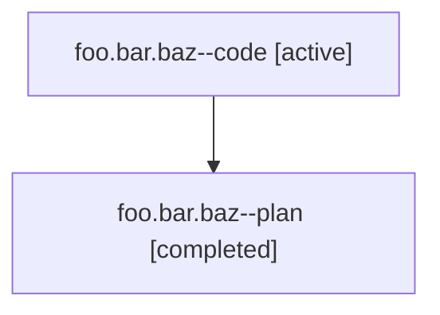

# Family: foo.bar.baz

[Agent Hoods](../README.md) / [alice](../users/alice/README.md) / [athena](../users/alice/machines/athena/README.md) / [foo](../users/alice/machines/athena/hoods/foo/README.md) / foo.bar.baz

Owner: `alice.athena` · Hood: `foo` · Members: 2

## Lineage

The diagram is an optional enhancement; the ordered table below contains the same lineage in accessible text.

| Role | Agent | State | Model / provider | Timing | Commits | Prompt | Chat |
|---|---|---|---|---|---:|---|---|
| code | foo.bar.baz--code | active | gpt | 2026-07-23T12:00:00+00:00 | 1 | [Prompt](../agents/alice.athena.foo.bar.baz--code/prompt.md) | — |
| plan | foo.bar.baz--plan | completed | gpt | 2026-07-23T12:00:00+00:00 → 2026-07-23T12:01:00+00:00 | 0 | [Prompt](../agents/alice.athena.foo.bar.baz--plan/prompt.md) | [Chat](../agents/alice.athena.foo.bar.baz--plan/chat.md) |
