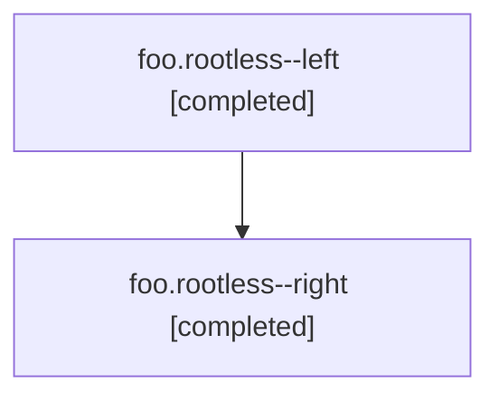

# Family: foo.rootless

[Agent Hoods](../README.md) / [alice](../users/alice/README.md) / [athena](../users/alice/machines/athena/README.md) / [foo](../users/alice/machines/athena/hoods/foo/README.md) / foo.rootless

Owner: `alice.athena` · Hood: `foo` · Members: 2

## Lineage

The diagram is an optional enhancement; the ordered table below contains the same lineage in accessible text.

| Role | Agent | State | Model / provider | Timing | Commits | Prompt | Chat |
|---|---|---|---|---|---:|---|---|
| left | foo.rootless--left | completed | gpt | 2026-07-23T12:00:00+00:00 → 2026-07-23T12:01:00+00:00 | 0 | [Prompt](../agents/alice.athena.foo.rootless--left/prompt.md) | [Chat](../agents/alice.athena.foo.rootless--left/chat.md) |
| right | foo.rootless--right | completed | gpt | 2026-07-23T12:00:00+00:00 → 2026-07-23T12:01:00+00:00 | 0 | [Prompt](../agents/alice.athena.foo.rootless--right/prompt.md) | [Chat](../agents/alice.athena.foo.rootless--right/chat.md) |

## Neighbors

| Agent | Relation | State |
|---|---|---|
| [foo](../agents/alice.athena.foo/README.md) | ancestor | completed |
| [foo.archive](../agents/alice.athena.foo.archive/README.md) | foo hood | dismissed |
| [foo.bar](../agents/alice.athena.foo.bar/README.md) | foo hood | completed |
| [foo.bar.baz](alice.athena.foo.bar.baz.md) (family · 2) | foo hood | active 1, completed 1 |
| [foo.bar.kazam](../agents/alice.athena.foo.bar.kazam/README.md) | foo hood | failed |
| [foo.boom](../agents/alice.athena.foo.boom/README.md) | foo hood | waiting |
